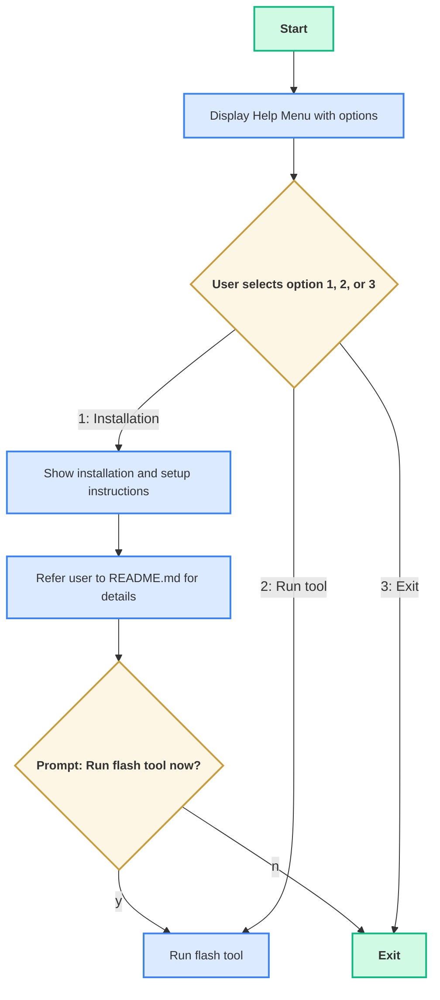
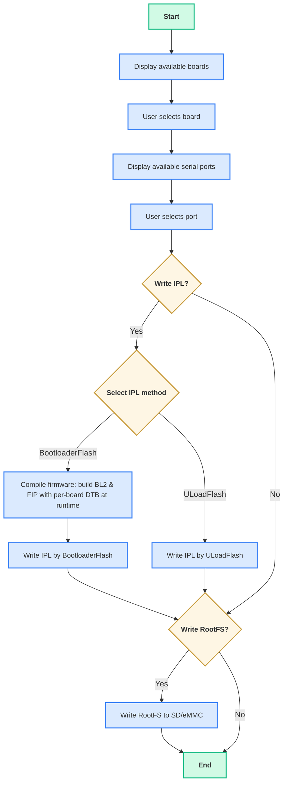

# Renesas RZ Common System

This guide provides a quick startup for all supported boards in the current release. This README describes the current development status, how to build images, and how to set up the environment for the following boards:

- [RZG2L-SBC](https://www.renesas.com/en/design-resources/boards-kits/rz-g2l-sbc?srsltid=AfmBOopW7k6H7kvdtnxYYs72c6Pm_8u667-UDBi8v9-WXPHjQvzWlhLN)
- [RZG2L-EVK](https://www.renesas.com/en/design-resources/boards-kits/rz-g2l-evkit?srsltid=AfmBOoqqLvuA9ZrzAhhRLi9JR1JVUcoc9MUICwtZ78ZER-hchmQ3ps5I)
- [RS-G2L100](https://www.renesas.com/en/products/microcontrollers-microprocessors/rz-mpus/rz-partner-solutions/geniatech-g2l100)
- [RZV2L-EVK](https://www.renesas.com/en/design-resources/boards-kits/rz-v2l-evkit?srsltid=AfmBOooz3AGWNCJNed1qk6NS0qeZBngU79XQ4h2KUkmMam82y615JPjr)
- [RZV2H-EVK](https://www.renesas.com/en/design-resources/boards-kits/rz-v2h-evk?srsltid=AfmBOooL-eoj5j3zum-HIL5v0JE9SROaKosWHYCOHfvySpJ4g39N9R_V)
- [RZV2H-RDK](https://www.renesas.com/en/design-resources/boards-kits/ws125-v2hrdkrefz)
- [IMDT V2H-SBC](https://www.renesas.com/en/products/microcontrollers-microprocessors/rz-mpus/rz-partner-solutions/imdt-v2-sbc)

## 1. Overview

This release targets the Renesas RZ/G2L, RZ/V2L, and RZ/V2H development products. It provides a comprehensive Linux BSP (Board Support Package) with various features and tools for developing embedded applications on the supported Renesas boards.

**Key Features (Common to most boards unless specified):**

* Verified Linux Package (VLP) Yocto build support
* Linux BSP functionality (pinned to the 6.10 baseline per platform)
* Codec libraries supported.
* On-board Audio Codec with Stereo Jack Analog Audio IO.
* Generic USB Bluetooth framework support.
* Bootloader with U-Boot Fastboot UDP enabled.
* Network Boot and TFTP support.
* Remote Access (SSH, SCP) and Debugging (GDBServer, VSCode, Eclipse).
* Postmortem Analysis via Core Dumps.
* Package Management using APT and DPKG.
* Docker Installation Support.

## 2. Building Yocto Images

This section details the steps to build the core Yocto images and extensible SDK (eSDK) for the supported boards.

### 2.1. Prepare the Build Environment

**Recommended Host OS:** Linux Ubuntu 24.04.

1.  **Install Required Packages:** Before starting the build, install the necessary packages on your Linux Host PC:
    ```bash
    $ sudo apt-get update
    $ sudo apt-get install build-essential chrpath cpio debianutils diffstat file \
    gawk gcc git iputils-ping libacl1 liblz4-tool locales python3 python3-git \
    python3-jinja2 python3-pexpect python3-pip python3-subunit socat texinfo unzip \
    wget xz-utils zstd
    ```

2.  **Configure Git:** Set your Git user name and email address:
    ```bash
    $ git config --global user.email "you@example.com"
    $ git config --global user.name "Your Name"
    ```

### 2.2. Prepare the Local Build Environment

1.  **Download Required Packages:** Download necessary proprietary packages (e.g., Codec libraries) from the Renesas website. For example: [RZ MPU Video Codec Library Evaluation Version](https://www.renesas.com/us/en/document/swo/rz-mpu-video-codec-library-evaluation-version-rzg2l-rtk0ef0045z15001zj-v110xxzip?r=1535641)

2.  **Create Workspace:** Create a workspace folder (e.g., `~/renesas/rz-cmn-srp`) for the build.
    ```bash
    $ mkdir ~/renesas/rz-cmn-srp
    ```

3.  **Copy Release Files:** Copy all the contents in folder `host/src/rz-cmn-srp/` from the release package into `~/renesas/rz-cmn-srp` folder. Also, copy any downloaded proprietary `.zip` files.
    ```bash
    $ cp *.zip ~/renesas/rz-cmn-srp                               # Copy downloaded proprietary packages
    $ cp -r host/src/rz-cmn-srp/* ~/renesas/rz-cmn-srp
    ```

### 2.3. Build Host Resource Configuration

Building certain recipes or the overall Yocto image can be resource-intensive for the build host (in terms of CPU and memory). To contribute to a stable and efficient build process and to assist in preventing Out-Of-Memory (OOM) conditions, configuration of BitBake's resource pressure monitoring is available.

BitBake utilizes **Linux Kernel's Pressure Stall Information (PSI)**, which provides insights into CPU, I/O, and Memory resource contention. PSI data is exposed via `/proc/pressure` and is supported in Linux kernels from version 4.20 onwards. If resource pressure exceeds configured thresholds, BitBake's scheduler may pause the initiation of new tasks, which can assist in preventing system unresponsiveness or Out-Of-Memory (OOM) conditions.

The following variables can be set in the `conf/local.conf` file to control BitBake's behavior under resource pressure:

* `BB_PRESSURE_MAX_CPU`: Configures the maximum tolerable CPU pressure threshold.
* `BB_PRESSURE_MAX_MEMORY`: Configures the maximum tolerable Memory pressure threshold.
* `BB_PRESSURE_MAX_IO`: *(Optional)* Configures the maximum tolerable I/O pressure threshold.

**Operation:**

The values assigned to these variables are expressed in internal "pressure units," which are not direct measurements (e.g., MiB/GiB). They represent the difference in "total" pressure from the preceding second. If the actual resource pressure on the build host surpasses the configured threshold, BitBake's scheduler is designed to temporarily suspend the commencement of new tasks until the pressure alleviates.

#### Suggested Default Pressure Thresholds

Based on Yocto Project documentation ([BitBake User Manual - Reference Variables](https://github.com/yoctoproject/poky/blob/master/bitbake/doc/bitbake-user-manual/bitbake-user-manual-ref-variables.rst)), the following values are used as initial configurations, intended to balance build execution speed with the stability of the build host:

```bash
# In conf/local.conf
BB_PRESSURE_MAX_MEMORY = "100000"
#BB_PRESSURE_MAX_CPU = "15000"
#BB_PRESSURE_MAX_IO = "15000" # May be included for disk-intensive builds
```

In the default `local.conf` configuration provided with this project, `BB_PRESSURE_MAX_MEMORY` is enabled with a value of "100000". `BB_PRESSURE_MAX_CPU` and `BB_PRESSURE_MAX_IO` are commented out by default.

**Note**: To enable or adjust any of these resource pressure variables, modify the corresponding lines in the `conf/local.conf` file by uncommenting them (if necessary) and setting the desired values. Please adjust these values as needed based on your specific build host and workload requirements.

### 2.4. Build Core Images

Navigate to your workspace folder and execute the build script.

```
$ cd ~/renesas/rz-cmn-srp
$ MACHINE<target_machine> IMAGE=<target_image> ./rz_builder.sh build
```
- <target_image>: the target Yocto build image. It can be one from the following list of supported images
- <machine_name>: the target machine name (e.g., rz-cmn, rzg2l-sbc, etc.)

| Target Image               | Description                                                                                 |
|----------------------------|---------------------------------------------------------------------------------------------|
| core-image-minimal         |  A basic image that contains the minimal set of components required to boot the device. It focuses on essential system functions without extra tools or features. |
| core-image-bsp             | Extends core-image-minimal with additional utilities and tools, providing a lightweight environment for system validation, hardware diagnostics, and basic development|
| core-image-weston          | A standard graphical image with Wayland and Weston support for embedded GUI applications.|
| renesas-core-image-cli     | Based on core-image-bsp, this image offers a CLI environment for Renesas hardware development without graphical interfaces.Besides the useful tools inherited from the core-image-bsp, this image also containsnew packages for SBC (Single Board Computer) development. For example,package managers (apt, dpgk), network utilities for Bluetooth, Wi-Fi. |
| renesas-core-image-weston  | Renesas customized core image based on the core-image-weston, with Qt5 framework support (no QT demo apps included). This image offers a full graphical environment for Renesas hardware development and all the useful tools from the renesas-core-image-cli.      |
| renesas-quickboot-cli      | This image has the same system functionality as the renesas-core-image-cli but with Quickboot enabled, allowing for faster boot times and efficient system validation on a CLI environment.|
| renesas-quickboot-wayland  | This image has the same system functionality as the renesas-core-image-weston but with Quickboot enabled, allowing for faster boot times and efficient system validation on a graphical environment              |
| renesas-ubuntu | Ubuntu-based image built on top of the ubuntu-tiny Yocto distro, ideal for embedded development. It includes core support for Wayland, X11, OpenGL, and Qt5, but does not include full development tools or environments. This image is not meant to be used as a Yocto rootfs, but rather as a foundation for pure Ubuntu-based systems that depend on Yocto-generated artifacts.|

**Note:**

**(1) Please note that this build requires internet access and will take several hours.**

**(2) If `IMAGE` is not set in the build command. The default image is `core-image-weston`.**

**(3) If `MACHINE` is not set in the build command, the default machine is `rz-cmn`, which builds for multiple board platforms.**

### 2.5. Collect the Output

After building Yocto with the ‘all-supported-images’ option, which builds all images at once, the output folder should be located at: `~/renesas/rz-cmn-srp/yocto_<target_board>/build/tmp/deploy/images/<target_board>`

For example: `~/renesas/rz-cmn-srp/yocto_cmn_board/build/tmp/deploy/images/rz-cmn`

The output directory generally should look as follows:

```sh
renesas@builder-pc:~/renesas/rz-cmn-srp/yocto_rzcmn_board/build/tmp/deploy/images/rz-cmn$ tree
.
├── host
│   ├── build
│   │   ├── <image-name>-<timestamp>.rootfs.manifest
│   │   ├── <image-name>-<timestamp>.testdata.json
│   │   ├── <image-name>.manifest -> <image-name>-<timestamp>.rootfs.manifest
│   │   └── <image-name>.testdata.json -> <image-name>-<timestamp>.testdata.json
│   ├── env
│   │   ├── core-image-bsp.env
│   │   ├── core-image-minimal.env
│   │   ├── core-image-weston.env
│   │   ├── Readme.md
│   │   ├── renesas-core-image-cli.env
│   │   ├── renesas-core-image-weston.env
│   │   ├── renesas-quickboot-cli.env
│   │   └── renesas-quickboot-wayland.env
│   ├── Readme.md
│   ├── src
│   │   └── rz-cmn-srp
│   │       ├── config.json
│   │       ├── files_to_add
│   │       │   └── meta-rz-features
│   │       │       ├── 0001-rzg2l-sbc-Bring-compat_alloc_user_space-back.patch
│   │       │       └── 0004-rzg2l-sbc-Get-interrupt-number.patch
│   │       ├── git_patch.json
│   │       ├── jq-linux-amd64
│   │       ├── patches
│   │       │   ├── meta-rz-features
│   │       │   │   └── 0001-support-codec-for-linux-6.10-and-yocto-styhead.patch
│   │       │   ├── meta-summit-radio
│   │       │   │   ├── 0001-rz-sbc-meta-summit-radio-Support-build-in-yocto-styh.patch
│   │       │   │   └── 0002-rz-sbc-summit-radio-support-eSDK-build.patch
│   │       │   └── poky
│   │       │       └── 0001-uboot-config-Fix-devtool-modify.patch
│   │       ├── README.md
│   │       ├── rz_builder.sh
│   │       └── ubuntu
│   │           ├── config
│   │           │   ├── common
│   │           │   │   ├── hostapd.conf
│   │           │   │   ├── hostapd.service
│   │           │   │   ├── moal.conf
│   │           │   │   └── resolved.conf
│   │           │   ├── ubuntu_core
│   │           │   │   ├── audio-init-core.sh
│   │           │   │   ├── network_interfaces.conf
│   │           │   │   └── NetworkManager.conf
│   │           │   └── ubuntu_lxde
│   │           │       ├── audio-init-lxde.sh
│   │           │       ├── connman-gtk.desktop
│   │           │       ├── force-display-xorg.sh
│   │           │       ├── force-xorg-display.service
│   │           │       ├── interfaces
│   │           │       ├── lightdm.conf
│   │           │       ├── NetworkManager.conf
│   │           │       ├── panel
│   │           │       ├── rsyslog
│   │           │       ├── ttyS0.conf
│   │           │       ├── v4l2-init.service
│   │           │       └── v4l2-init.sh
│   │           ├── config.ini
│   │           ├── docs
│   │           │   ├── ubuntu_core
│   │           │   │   └── README.md
│   │           │   └── ubuntu_lxde
│   │           │       ├── Pictures
│   │           │       │   ├── audacity.png
│   │           │       │   ├── audio_settings.png
│   │           │       │   ├── bluetooth_0.png
│   │           │       │   ├── bluetooth_1.png
│   │           │       │   ├── bluetooth_2.png
│   │           │       │   ├── bluetooth_3.png
│   │           │       │   ├── bluetooth_4.png
│   │           │       │   ├── csi_0.png
│   │           │       │   ├── csi_1.png
│   │           │       │   ├── csi_2.png
│   │           │       │   ├── eth_1.png
│   │           │       │   ├── eth_2.png
│   │           │       │   ├── eth_3.png
│   │           │       │   ├── eth_4.png
│   │           │       │   ├── eth_5.png
│   │           │       │   ├── eth.png
│   │           │       │   ├── save_audio_0.png
│   │           │       │   ├── save_audio_1.png
│   │           │       │   ├── save_audio_2.png
│   │           │       │   ├── vlc_open_0.png
│   │           │       │   ├── vlc_open_1.png
│   │           │       │   ├── vlc_open_2.png
│   │           │       │   ├── vlc.png
│   │           │       │   ├── vlc_video_1.png
│   │           │       │   ├── vlc_video.png
│   │           │       │   ├── web_1.png
│   │           │       │   ├── web_2.png
│   │           │       │   ├── web_lxterm_htop.png
│   │           │       │   ├── web.png
│   │           │       │   └── wifi_0.png
│   │           │       └── README.md
│   │           ├── include
│   │           │   ├── common
│   │           │   │   ├── allow_empty_password.sh
│   │           │   │   ├── create_wic.sh
│   │           │   │   ├── install_gstreamer.sh
│   │           │   │   ├── install_imdt_utils.sh
│   │           │   │   ├── install_weston.sh
│   │           │   │   ├── mount.sh
│   │           │   │   ├── prepare_env_rootfs.sh
│   │           │   │   ├── prepare_env.sh
│   │           │   │   ├── prepare_ubuntu_base.sh
│   │           │   │   ├── setup_conf.sh
│   │           │   │   └── yocto_working.sh
│   │           │   ├── ubuntu_core
│   │           │   │   ├── prepare_conf.sh
│   │           │   │   ├── prepare_env.sh
│   │           │   │   └── prepare_rootfs.sh
│   │           │   └── ubuntu_lxde
│   │           │       ├── create_swap.sh
│   │           │       ├── prepare_conf.sh
│   │           │       └── prepare_rootfs_qt.sh
│   │           ├── README.md
│   │           ├── script
│   │           │   ├── common
│   │           │   │   ├── dpkg-install-lock-fix.sh
│   │           │   │   ├── enable_ping.sh
│   │           │   │   └── setup_dns_and_time.sh
│   │           │   ├── ubuntu_core
│   │           │   │   ├── apt_install_base.sh
│   │           │   │   ├── link_to_leagcy_iptables.sh
│   │           │   │   └── set_root_password.sh
│   │           │   └── ubuntu_lxde
│   │           │       ├── apt_audio_video.sh
│   │           │       ├── apt_blueman.sh
│   │           │       ├── apt_install_base.sh
│   │           │       ├── apt_lxde_desktop.sh
│   │           │       ├── apt_wifi_ble.sh
│   │           │       ├── create_user.sh
│   │           │       ├── enable_service.sh
│   │           │       ├── set_root_password.sh
│   │           │       ├── set_swap_enable.sh
│   │           │       └── setup-set-permissions.sh
│   │           └── setup_ubuntu_environment.sh
│   └── tools
│       ├── bin
│       │   ├── linux
│       │   │   ├── bpgen
│       │   │   ├── fiptool
│       │   │   ├── libcrypto.so.1.1
│       │   │   ├── OPENSSL_LICENSE.txt
│       │   │   └── Readme.md
│       │   ├── Readme.md
│       │   └── windows
│       │       ├── bpgen.exe
│       │       ├── fiptool.exe
│       │       ├── GNU_BINUTILS_LICENSE.txt
│       │       ├── libcrypto-3-x64.dll
│       │       ├── libwinpthread-1.dll
│       │       ├── LIBWINPTHREAD_LICENSE.txt
│       │       ├── objcopy.exe
│       │       ├── OPENSSL_LICENSE.txt
│       │       └── Readme.md
│       ├── bootloader_flasher
│       │   ├── bootloader_flash.py
│       │   └── README.md
│       ├── config
│       │   ├── boards_flash_config.toml
│       │   └── README.md
│       ├── firmware_compile
│       │   ├── firmware_compile.py
│       │   └── Readme.md
│       ├── flash_images.json
│       ├── README.md
│       ├── requirements.txt
│       ├── sd_creator
│       │   ├── README.md
│       │   ├── sd_flash.py
│       │   └── tools
│       │       ├── AdbWinApi.dll
│       │       ├── AdbWinUsbApi.dll
│       │       ├── fastboot.exe
│       │       └── NOTICE.txt
│       ├── uload_bootloader
│       │   ├── README.md
│       │   └── uload_bootloader_flash.py
│       └── universal_flash.py
├── license
│   └── Disclaimer051.pdf
├── <code>-rz-cmn-srp-um-quick-start-guide.pdf
├── <code>-rz-cmn-srp-um.pdf
├── README.md
├── RZ_System_Release_Package_Evaluation_license.pdf
└── target
    ├── env
    │   ├── Readme.md
    │   └── uEnv.txt
    ├── images
    │   ├── atf
    │   │   ├── bl2-rz-cmn.bin
    │   │   ├── bl31-rz-cmn.bin
    │   │   ├── fdts
    │   │   │   ├── <board-name>.dtb
    │   │   │   └── Readme.md
    │   │   └── Readme.md
    │   ├── core-image-bsp.wic
    │   ├── core-image-minimal.wic
    │   ├── core-image-weston.wic
    │   ├── Flash_Writer_SCIF_<board-name>.mot
    │   ├── Flash_Writer_SCIF_<board-name>_PMIC.mot
    │   ├── linux
    │   │   ├── dtbs
    │   │   │   ├── overlays
    │   │   │   │   ├── Readme.md
    │   │   │   │   └── <board-name>-<rev-major>.<rev-minor>-<feature>.dtbo
    │   │   │   ├── <board-name>--<kernel-version>-rz-cmn-<timestamp>.dtbo
    │   │   │   ├── <board-name>.dtb -> <board-name>--<kernel-version>-rz-cmn-<timestamp>.dtbo
    │   │   │   └── Readme.md
    │   │   ├── Image -> Image--<kernel-version>-rz-cmn-<timestamp>.bin
    │   │   ├── Image--<kernel-version>-rz-cmn-<timestamp>.bin
    │   │   └── Readme.md
    │   ├── Readme.md
    │   ├── renesas-core-image-cli.wic
    │   ├── renesas-core-image-weston.wic
    │   ├── renesas-quickboot-cli.wic
    │   ├── renesas-quickboot-wayland.wic
    │   ├── ubuntu-core-image.wic.gz
    │   ├── ubuntu-lxde-image.wic.gz
    │   ├── rootfs
    │   │   ├── core-image-bsp.tar.bz2
    │   │   ├── core-image-minimal.tar.bz2
    │   │   ├── core-image-weston.tar.bz2
    │   │   ├── Readme.md
    │   │   ├── renesas-core-image-cli.tar.bz2
    │   │   ├── renesas-core-image-weston.tar.bz2
    │   │   ├── renesas-quickboot-cli.tar.bz2
    │   │   ├── renesas-quickboot-wayland.tar.bz2
    │   │   ├── ubuntu-lxde-image.tar.bz2
    │   │   └── ubuntu-core-image.tar.bz2
    │   ├── <board>-<version>-platform-settings.bin
    │   ├── <board>-<version>-platform-settings.srec
    │   └── u-boot
    │       ├── dtbs
    │       │   ├── Readme.md
    │       │   └── <board-name>.dtb
    │       ├── Readme.md
    │       └── u-boot-nodtb-rz-cmn.bin
    └── Readme.md
```

- host/: This directory holds all the tools, scripts, and artifacts needed on the host machine for building 
and preparing the system images.
  - build/: Contains build artifacts (manifests and test data).
    - Manifest file: Files like core-image-bsp-<timestamp>.rootfs.manifest lists the contents of the generated root file system.
    - Test data: Files with the *.testdata.json extension that contains metadata or test results of the said image.

  - env/: Provides environment configuration files used during the build or runtime.
    - .env Files: Examples include core-image-bsp.env or core-image-minimal.env, which define variables and configuration parameters for different image variants.

  - src/: Holds build scripts, source code, and patches that are used to build the package.
    - rz-cmn-srp/: The folder that contains artifacts to build Yocto and Ubuntu images.
      - Patches: Located in the patches/ subdirectory, these files (For example, 
  0001-...patch) apply for necessary modifications.
      - Build scripts: The master script rz_builder.sh automates the build process 
  for both Ubuntu and Yocto packages, handling setup, configuration, and 
  image generation based on user-selected build options.
      - Configuration files: site.conf, which is used to set up a specific build tag.
      - config.json: Contains the available build image options grouped by build
  type, including Yocto images, Ubuntu images, and static image collections 
  (all-yocto-images, all-ubuntu-images, all-supported-images).
      - git_patch.json: Contains json keys and repository configuration such as: url, 
  branch, tag, commit, repo type and patch paths to apply.
    - ubuntu/: Main folder for Ubuntu-based image generation for RZ boards.
    - config/: The folder that holds configuration files for different Ubuntu variants.
    - docs/: Contains documentation detailing supported features and usage 
instructions for each Ubuntu image variant.
    - script/: The folder that contains all scripts related to Ubuntu image creation.
    - config.ini: Configuration file that defines key parameters for the Ubuntu image 
build process, such as the Ubuntu variant, base image, output filenames, and 
system settings.
    - setup_ubuntu_environment.sh: Main entry-point script (acts like a dispatcher/header). It sources and sequences logic from the modular scripts under script/. It does not build anything by itself.
  - tools/: Provides utilities to assist with tasks such as bootloader flashing, uload-bootloader flashing, and SD card image creation using a single script that can run on both Linux and Windows.

- target/: This directory includes all the files needed for deploying the system on target hardware.
  - env/: Contains environment configuration files that are used during boot-up on the target 
  device.
  Key file:
    - uEnv.txt: A file that holds boot configuration parameters.
  - images/: Holds the final system images and associated files required for the target device.
      - atf: The RZ Common Arm Trusted-firmware (TF-A) directory contains BL2, BL31 binaries and TF-A configuration DTBs (FDTS).
      - u-boot/: The RZ Common U-Boot directory contains the U-Boot binaries and device tree blobs (DTBs) used across all supported boards.
      - linux/: The directory contains linux kernel and device trees for the target images.
      - System images: Files with the ‘.wic’ extension corresponding to different build variant (BSP, minimal, Weston, Renesas images).
      - rootfs folder: Compressed archives (For example, core-image-bsp.tar.bz2) contain the root file system for each image.
      - `flash-writer/`: Flash Writer binaries (per board), e.g.:
        - `Flash_Writer_SCIF_<board-name>.mot`
        - `Flash_Writer_SCIF_<board-name>_PMIC.mot` (includes PMIC init)
      - `board-id/`: Board identification binaries (per board/version), e.g.:
        - `<board>-<version>-platform-settings.bin`
        - `<board>-<version>-platform-settings.srec`
- README.md (root level): This is the comprehensive guide that provides an overview of the 
  entire release package, including instructions on how to use, build, and deploy the system.

### 2.6. Build the Extensible SDK (eSDK)

The extensible SDK (eSDK) simplifies the process of adding new applications and libraries to an image, modifying existing components, testing changes on RZ boards, and integrating with the OpenEmbedded Build System.

The eSDK build process generates an installer, which is intended to be used on the same host system where the Yocto environment is configured.

To build the eSDK, run the following command:

```shell
$ IMAGE=<target_image> ./rz_builder.sh build-sdk
```

For example:

```shell
$ IMAGE=renesas-core-image-weston ./rz_builder.sh build-sdk
```

The resulting eSDK installer will be located in `~/renesas/rz-cmn-srp/yocto_cmn_board/build/tmp/deploy/sdk`.
The eSDK installer will have the extension ".sh".

```shell
$ ls
poky-glibc-x86_64-renesas-core-image-weston-cortexa55-rz-cmn-toolchain-ext-5.1.4.sh
poky-glibc-x86_64-renesas-core-image-weston-cortexa55-rz-cmn-toolchain-ext-5.1.4.host.manifest
poky-glibc-x86_64-renesas-core-image-weston-cortexa55-rz-cmn-toolchain-ext-5.1.4.testdata.json
poky-glibc-x86_64-renesas-core-image-weston-cortexa55-rz-cmn-toolchain-ext-5.1.4.target.manifest
```

**Note:**
**(1) The SDK build may fail depending on the build environment. At that time, please run the build again after a period of time.**

**(2) The SDK result of the `ls` command is built using the target image `IMAGE=renesas-core-image-weston`. Other SDKs will be located in the same location `~/renesas/rz-cmn-srp/yocto_cmn_board/build/tmp/deploy/sdk` but will have different names according to the target image.**

#### 2.6.1. Installing the eSDK on the Host System

The eSDK enables development and testing of custom applications for RZ boards across various systems. This section describes the setup process.

```shell
$ sh ./build/tmp/deploy/sdk/poky-glibc-x86_64-renesas-core-image-weston-cortexa55-rz-cmn-toolchain-ext-5.1.4.sh
```

Before building applications with the eSDK, source the environment setup script. Replace `~/esdk/5.1.4` with the actual installation path:

```shell
$ source ~/esdk/5.1.4/environment-setup-cortexa55-poky-linux
```

This step is required for each new terminal session before running eSDK tools or compiling applications.

#### 2.6.2. Using `devtool` in the Yocto eSDK

This section shows how to use the eSDK's `devtool` workspace for modifying, testing, and maintaining recipes without touching upstream metadata. It focuses on Linux kernel, device tree, and driver changes on the Renesas RZ Common System.

##### 2.6.2.1 Overview

`devtool` is part of the Yocto Project **Extensible SDK (eSDK)**. It provides an isolated workspace to:
- fetch and modify recipe sources locally,
- build those changes,
- and integrate them into a full image for testing.

##### 2.6.2.2 Prerequisites
1. Install/extract the Yocto eSDK (see Section 2.6.1. Installing the eSDK on the Host System).  
2. Source the eSDK environment:
   ```bash
   source /path/to/poky_sdk/environment-setup-<arch>-poky-linux
   # Example:
   source ~/poky_sdk/environment-setup-cortexa55-poky-linux
   ```
   You should see:
   ```
   SDK environment now set up; additionally you may now run devtool to perform development tasks.
   Run devtool --help for further details.
   ```

##### 2.6.2.3 Common Usage Scenarios

###### A) `devtool modify` — Prepare a workspace

Checks out the recipe's source into the workspace so changes don't touch upstream layers.

**Syntax**
```bash
devtool modify <recipe>
```

**Example (Linux kernel)**

```bash
devtool modify linux-yocto
```

This will:
- create the kernel source under `~/poky_sdk/workspace/sources/linux-yocto/`,
- create a `.bbappend` for `linux-yocto` in `~/poky_sdk/workspace/appends/`,
- prepare the environment for kernel edits.

**(1) Applying kernel patches (linux-yocto)**  
In this BSP, `linux-yocto` is out-of-tree:
- Patches are stored in: `workspace/sources/linux-yocto/.kernel-meta/`
- The default config (e.g., `renesas_defconfig`) is managed out-of-tree.

Apply the patch queue after `devtool modify`:

```bash
cd ~/poky_sdk/workspace/sources/linux-yocto/.kernel-meta
git am $(cat patch.queue)
```

After applying patches you may:
- add kernel config fragments,
- or directly build with `devtool build linux-yocto`.

**(2) Adding kernel configuration**

*Method 1 — Edit out‑of‑tree defconfig*  

Edit the defconfig shipped in your layer (example path):
```
~/poky_sdk/layers/meta-renesas/recipes-kernel/linux/rz-cmn/common/renesas_defconfig
```

*Method 2 — Add a config fragment (.cfg)*

```bash
# Create the append skeleton
mkdir -p ~/poky_sdk/workspace/appends/linux-yocto/files

# Example fragment: enable USB-serial and FTDI
cat > ~/poky_sdk/workspace/appends/linux-yocto/files/usb-serial-ch341.cfg <<'EOF'
CONFIG_USB_SERIAL=y
CONFIG_USB_SERIAL_CH341=y
EOF
```

Create/modify the bbappend (version may vary):

```bash
vim ~/poky_sdk/workspace/appends/linux-yocto/linux-yocto_6.10.bbappend
```

Append the fragment to `SRC_URI`:

```bitbake
SRC_URI:append = " file://usb-serial-ch341.cfg"
```

###### B) `devtool build` — Build the recipe
Compiles the currently‑modified recipe from the workspace.

**Syntax**
```bash
devtool build <recipe>
```

**Example**
```bash
devtool build linux-yocto
```

**What it does**
- Uses the workspace sources (`devtool modify <recipe>`).
- Runs normal BitBake tasks (`do_compile`, `do_install`, packaging).
- Produces deployable artifacts depending on the recipe.

**What it does *not* do**
- It does **not** build a complete image. Use `devtool build-image <image>` for that.

**Typical output locations**
- Workdir (per recipe/machine):  
  `<sdk-root>/tmp/work/<machine>-poky-linux/<recipe>/<version>/`
- Deployed artifacts (if the recipe deploys output):  
  `<sdk-root>/tmp/deploy/`

For `linux-yocto`, examples:
- Kernel modules (`.ko`):  
  `~/poky_sdk/tmp/work/rz-cmn-poky-linux/linux-yocto/6.10.14+git/image/usr/lib/modules/6.10.14-yocto-standard/kernel/`
- Kernel Image & DTBs (examples):  
  - In workdir:  
    `~/poky_sdk/tmp/work/rz-cmn-poky-linux/linux-yocto/6.10.14+git/image/boot/`  
  - In deploy (if deployed by recipe):  
    `~/poky_sdk/tmp/deploy/images/rz-cmn/target/images/linux`

> **Note (Ubuntu-based rootfs):** If artifacts from `devtool build` (e.g., `Image`, DTBs, modules) are intended for Ubuntu-based images (`ubuntu-core-image`, `ubuntu-lxde-image`), build with `DISTRO=ubuntu-tiny`:
> ```bash
> export DISTRO=ubuntu-tiny
> devtool build <recipe>
> ```

###### C) `devtool reset` — Clean up the workspace
Removes the workspace copy and restores the original recipe.

**Syntax**
```bash
devtool reset <recipe>
```

**Example**
```bash
devtool reset linux-yocto
```
This deletes the workspace sources and temporary `.bbappend` files. Changes not captured with `devtool update-recipe` will be lost.

###### D) `devtool build-image` — Build a full target image
Builds a complete image **including** outputs from workspace recipes (useful for end‑to‑end tests).

**Syntax**
```bash
devtool build-image <image>
```

**Example**
```bash
devtool build-image core-image-weston
```

**Behavior**
- Rebuilds the specified image.
- Auto‑includes outputs from modified workspace recipes.
- Produces bootable images in deploy, e.g.:
  - `.wic` (complete image):  
    `<sdk-root>/tmp/deploy/images/<machine>/target/images/`
  - compressed rootfs (for flashing/NFS):  
    `<sdk-root>/tmp/deploy/images/<machine>/target/images/rootfs`

Use this after testing a single recipe (e.g., `linux-yocto`) to validate integration across the full system.

**Note:** If the workspace got into a bad state, reset and re-import:

```
devtool reset <recipe>
devtool modify <recipe>
# re-apply patches/config (if needed), then:
devtool build <recipe>

# or build the image
devtool build-image <target-image>
```

## 3. Programming/Flashing Images

This section explains how to program and flash various firmware and root file system images onto  Renesas boards. It covers firmware components, prerequisites hardware setup for each board, and usage of the universal flashing script for seamless flashing workflows.

This package contains the following firmware components.

### 3.1. Firmware Description

| Module                     | Binary / Files                                   | Stack Layer | Description |
|---------------------------|--------------------------------------------------|-------------|-------------|
| ROM code                  | N/A                                              | BL1         | Internal ROM executed by the SoC's primary core at power‑on reset (POR). |
| Flash Writer              | `Flash_Writer_SCIF_<board>.mot`                  | BL2         | Factory serial loader: BL1 (ROM) loads it into SRAM via UART **SCIF0**; it then receives another image over SCIF0 and flashes to **xSPI/QSPI** or **eMMC** boot sectors. Provides a command‑based UI. |
| Arm Trusted Firmware‑A    | `bl2-rz-cmn.bin`, `bl31-rz-cmn.bin`, `<board>.dtb` | BL2 & BL31  | Minimal TF‑A (without DTB embedded). The flashing script dynamically combines `bl2-rz-cmn.bin` with the device tree during flashing. Distributed in **.bin** format only (raw in‑system flashing). |
| U‑Boot (BL33)             | `u-boot-nodtb-rz-cmn.bin`, `<board>.dtb`         | BL33        | U‑Boot (nodtb) binary and matching device tree; the flashing script packages these into the FIP. |
| Board Identification      | `<board>-platform-settings.bin`                  | —           | Stores platform settings (model IDs, revisions, memory locations, image sizes) so firmware/bootloaders can identify hardware and locate boot components efficiently during startup or flashing. |

> **Note**: A prebuilt FIP is **not** shipped. The flashing script builds a valid FIP at flash time from `bl31-rz-cmn.bin`, `u-boot-nodtb-rz-cmn.bin`, and `<board>.dtb`. It also merges `bl2-rz-cmn.bin` with `<board>.dtb` to create the BL2 image flashed to the boot sector.

### 3.2. Prerequisites:

Before flashing any images, ensure the following system requirements are met on your host PC and 
that necessary files and tools are available.

- Operating Systems
  - Linux (Ubuntu 20.04 or newer recommended)
  - Windows 10 or newer
- Software
  - Python 3.8 or later
  - GNU Binutils (for `objcopy`)
  - Firmware release package (images and tools)
- Hardware
  - Required cables: USB and UART debug cable
  - SD card (8 GB or larger)

#### Linux Setup

1. **Install Python 3**
   ```bash
   sudo apt install python3
   ```

2. **Install Python dependencies**  
   It is recommended to use a virtual environment with any supported Python version (3.10, 3.11, or 3.12).

   If Python 3.12 is in use: set up a virtual environment first.

   ```bash
   sudo apt update
   sudo apt install python3.12-venv
   python3 -m venv .venv
   source .venv/bin/activate
   ```

   If the distribution uses a different Python 3 version (for example, 3.10 or 3.11), replace 3.12 with the appropriate version.
    
   After activating the virtual environment, choose one of the two install methods:

   - Option 1 - Use `requirements.txt` (recommended)
   ```sh
   cd <path/to/package>/host/tools/
   pip3 install -r requirements.txt
   ```

   - Option 2 - Install manually
   ```sh
   # Ensure pip is available
   sudo apt install python3-pip

   # Install required packages
   pip3 install pyserial
   pip3 install dataclasses
   ```

#### Windows Setup
1. **Install Python 3**
   - Download and install from <https://www.python.org/>.  
   - Enable **"Add Python to environment variables."**  
   If `pip` is missing, repair your Python installation or download [get-pip.py](https://bootstrap.pypa.io/get-pip.py) and run:

    ```powershell
    py get-pip.py
    ```

2. **Install Python dependencies**  
   - **Option 1 — Using `requirements.txt` (recommended)**
     ```powershell
     cd <path\to\the\package>\host\tools
     py -m pip install -r requirements.txt
     ```
   - **Option 2 — Install manually**
     - Using the Python launcher:
     ```powershell
     py -m pip install pyserial
     py -m pip install tomli
     py -m pip install dataclasses       # Only if Python < 3.7
     ```
     - Or using `pip` directly (if already in PATH):
     ```powershell
     pip install pyserial
     pip install tomli
     pip install dataclasses   # only if Python < 3.7
     ```

### 3.2.2. Environment and Tool Dependencies

Make sure you have the following installed or available in `tools/bin/<os>` or `host/tools/bin/<os>`:
- `bpgen` - unified boot parameter generator (already included in the release package)
- `fiptool` - TF-A utility (already included in the release package)
- `objcopy` - part of GNU binutils (see installation steps above)

Firmware binaries and DTBs must be available in the following location (already included in the release package):

```
target/images/
```

#### Linux

Install the required toolchain and fastboot:

```sh
sudo apt-get update
sudo apt-get install build-essential android-tools-fastboot -y
```

#### Windows

**USB OTG Flashing on Windows**

Fastboot/OTG flashing on Windows requires the device's **Fastboot / USB-download** interface to use the **WinUSB** driver.

> **Note:** Windows binds drivers to the **device/interface present at install time** (VID/PID[/MI]). This Fastboot interface exists **only while** the board is connected over OTG **and** go to OTG download mode.

**Steps to verify USB OTG dependencies are installed correctly:**

1. **Prepare connections**
   - Connect the board's USB-to-serial to the PC and open a terminal (115200 8-N-1).
   - Open **Tera Term** (or any serial console) on the correct COM port/baud.

2. **Enter U-Boot and switch to USB OTG Fastboot**
   - **Power on** the board and **interrupt autoboot** to get a `U-Boot>` prompt.
   - Connect the board's **USB OTG** port to the PC.
   - At the U-Boot prompt, run:
     ```bash
     setenv serial# 'Renesas1'
     fastboot usb 27
     ```
     > This places the board into **USB OTG fastboot/download** mode.\
     > `27` is the index used on RZ Common System

3. **Bind WinUSB using Zadig**
   - Download the latest **[Zadig](https://zadig.akeo.ie/)** and run it (no installation needed).
   - In Zadig, go to **Options → List All Devices**.
   - From the dropdown, select the device that represents the bootloader/fastboot interface.
     - **USB Download Gadget**
   - On the right, set **Driver** to **WinUSB**.
   - Click **Install Driver** (or **Replace Driver**).

4. **Verify**
   - Open **PowerShell** or **Command Prompt** and run:
     ```powershell
     .\path\to\package\sd_creator\tools\fastboot.exe devices
     ```

     Expected:
     ```
      Renesas1         fastboot
     ```

> [!NOTE]  
> **All dependencies bundled for Windows - No Installation Required**  
> All required tools and runtime libraries are pre-bundled in `tools/bin/windows/`:
> - `fiptool.exe` + `libcrypto-3-x64.dll` (OpenSSL library)
> - `bpgen.exe` (statically linked, no DLLs needed)
> - `objcopy.exe` + `libwinpthread-1.dll` (MinGW runtime)
>
> **You do NOT need to install MinGW-w64, MSYS2, or OpenSSL.** The scripts automatically use the bundled binaries.

### 3.3. Universal Flashing Script

`universal_flash.py` is a cross-platform tool that simplifies flashing workflows. It uses a board configuration JSON (`flash_images.json`) to map images and procedures.

**Location**
```
<path/to/package>/host/tools/universal_flash.py
```

**Tools directory hierarchy** (excerpt)
```
host/tools/
├─ bin/
├─ bootloader_flasher/
├─ config/
├─ firmware_compile/
├─ flash_images.json
├─ README.md
├─ requirements.txt
├─ sd_creator/
├─ uload_bootloader/
└─ universal_flash.py
```

#### 3.3.1. `flash_images.json` — File Overview and Usage

`flash_images.json` maps **boards → binaries → flashing operations**. It lists which images belong to each board, where they are located, and which flashing methods (e.g., **xSPI** vs **eMMC**, **UDP** vs **OTG**) apply.

**Location**
- Must reside beside `universal_flash.py`.
- Images are typically under `<path_to_release>/target/images/` (optionally with subfolders like `atf/`, `u-boot/dtbs/`).

##### JSON Structure (Schema)

| Key                   | Description                                                                 | Allowed / Example Values                  |
|-----------------------|-----------------------------------------------------------------------------|-------------------------------------------|
| `soc`                 | SoC/MPU family identifier                                                   | `g2l`, `v2l`, `v2h`                       |
| `bl2`                 | BL2 (stage 2) image containing FCONF device tree                            | `bl2_bp_<board>.srec`                     |
| `board_identification`| Board‑info binary from `binmake` (not the JSON source)                      | `<board>-platform-settings.bin`           |
| `fip`                 | FIP image containing BL31 and U‑Boot nodtb+DTB                              | `fip_<board>.srec`                        |
| `atf_fdts`            | FCONF DTB(s) for BL2                                                         | `<board>.dtb`                             |
| `uboot_dtb`           | U‑Boot device tree blob                                                      | `<board>.dtb`                             |
| `flash_writer`        | Flash Writer binary for low‑level programming                                | `Flash_Writer_SCIF_<board>.mot`           |
| `ipl_flash_method`    | IPL media used for flashing                                                  | `xspi`, `emmc`                            |
| `rootfs`              | Root filesystem image                                                        | `core-image-minimal.wic`                  |
| `rootfs_flash_method` | Method to flash rootfs                                                       | `udp`, `otg`                              |

##### JSON Configuration for a New Board

The `flash_images.json` file is located at the same level as the universal script and contains predefined image mappings for supported devices. The images referenced for flashing must be placed in the directory:`</path/to/your/yocto/package>/target/images`.

`flash_images.json` supports several default boards. Custom board can be added to the configuration file by providing the following information:

- **soc**: SoC type
- **bl2**: BL2 image name
- **board_identification**: Board identification image name
- **fip**: FIP image name
- **atf_fdts**: FCONF device tree name
- **uboot_dtb**: U-boot device tree name
- **flash_writer**: Flash Writer image name
- **ipl_flash_method**: Method used by the IPL bootloader for flashing (`qspi` or `emmc`)
- **rootfs**: Root filesystem image name (`*.wic`)
- **rootfs_flash_method**: Method to flash the SD card (`udp` or `otg`)

Example of a sample board configuration in JSON:

```json
"rzg2l-sbc": {
    "soc": "g2l",
    "bl2": "bl2_bp_rzg2l-sbc.srec",
    "board_identification": "rzg2l-sbc-platform-settings.bin",
    "fip": "fip_rzg2l-sbc.srec",
    "atf_fdts": "rzg2l-sbc.dtb",
    "uboot_dtb": "rzg2l-sbc.dtb",
    "flash_writer": "Flash_Writer_SCIF_rzg2l-sbc.mot",
    "ipl_flash_method": "xspi",
    "rootfs": "core-image-minimal.wic",
    "rootfs_flash_method": "udp"
}
```

This table below lists the available options (and sensible defaults) for `ipl_flash_method` and `rootfs_flash_method` per board.

| Board                 | SoC | `ipl_flash_method` (options) | Default | `rootfs_flash_method` (options)  | Default |
|-----------------------|-----|------------------------------|---------|----------------------------------|---------|
| **rzg2l-sbc**         | g2l | `xspi`                       | `xspi`  | `udp`                            | `udp`   |
| **rzg2l-evk**         | g2l | `xspi`, `emmc`               | `xspi`  | `udp`, `otg`                     | `otg`   |
| **rs-g2l100**         | g2l | `xspi`                       | `xspi`  | `udp`, `otg`                     | `otg`   |
| **rzv2l-evk**         | v2l | `xspi`, `emmc`               | `xspi`  | `udp`, `otg`                     | `otg`   |
| **rzv2h-evk**         | v2h | `xspi`                       | `xspi`  | `udp`, `otg`                     | `otg`   |
| **rzv2h-rdk**         | v2h | `xspi`                       | `xspi`  | `udp`                            | `udp`   |
| **imdt-v2h-sbc**      | v2h | `xspi`                       | `xspi`  | `udp`, `otg`                     | `otg`   |

**Notes:**
- *IPL flash method*: `emmc` for `rzv2h-evk` is **not supported yet**.
- *IPL flash method*: `eSD` for all boards is **not supported yet**.
- *The RZ/G2L-SBC* board does not provide a USB OTG port; accordingly, OTG is not supported.
---

Field Reference

- **`ipl_flash_method`**
  Defines where the **IPL/BL2** image is flashed:
  - `xspi` — xSPI flash for RZ/V2H, QSPI for RZV2L/RZG2L
  - `emmc` — eMMC device

- **`rootfs_flash_method`**
  How the **root filesystem (.wic)** is delivered to the SD/eMMC target:
  - `udp` — U-Boot `fastboot udp` over Ethernet
#### 3.3.2. Flowchart

The universal flash script prompts the user for options and proceeds through the flashing process based on the input. The detailed procedure is as follows:
##### Help Menu Flowchart

The following flowchart illustrates the logic when running the help command for the universal flash tool. It shows the user interaction steps and options available:



To display this help menu, use the following command:

- **On Linux:**
  ```bash
  python3 universal_flash.py --help
  ```

- **On Windows:**
  ```powershell
  py universal_flash.py --help
  ```

##### Installation Flowchart
This flowchart shows the process when running the universal flash tool directly (without the --help argument). The script will immediately start the flashing workflow:



**Explanation:**
When you run the script without any arguments, it will skip the help menu and immediately prompt you to select a board and begin the flashing process. You will be guided through board selection, serial port setup, IPL and rootfs flashing steps.

Refer to the [Basic Usage](#basic-usage) section for commands to run the tool.

**Notes:**
- Ensure the board is powered off before flashing.
- Insert the SD card if rootfs flashing is selected.
- For Bootloader-flash: set boot switches to SCIF download mode.
- For Uload-flash or rootfs flashing: set boot switches to normal mode.
- **Reset and power-cycle behavior by board:**
  - **RZ/G2L-SBC**
    This board does not provide a dedicated **RESET** button. To restart the board or apply a boot mode change, you must power-cycle it.
  - **RZ/G2L-EVK** and **RZ/V2L-EVK**
    These boards provide a **RESET** button. You can reset the board without removing power, and the USB connection and serial port typically remain available.
  - **RS-G2L100**
    This board does not provide a dedicated **RESET** button. To restart the board or apply a boot mode change, you must power-cycle it.
  - **RZ/V2H-EVK**
    This board provides a **RESET** button. You can reset the board without removing power, and the USB connection and serial port typically remain available.
  - **RZ/V2H-RDK**
    This board does not provide a dedicated **RESET** button. To restart the board or apply a boot mode change, you must power-cycle it by unplugging and reconnecting the power adapter. Because the USB serial interface is powered from the same source, the USB device disconnects during power-cycle and the serial port disappears from the host PC. When power-cycling the board, keep the USB cable connected to the same USB port on the host PC to avoid enumeration or reconnection issues.
  - **IMDT V2H-SBC**
    This board provides a **RESET** button. You can reset the board without removing power, and the USB connection and serial port typically remain available.
- Rootfs flash (UDP Fastboot): U-Boot fastboot-udp uses a single active Ethernet MAC per board. If multiple RJ45/PHY ports exist, only one is active (depending on board support). The script automatically selects the appropriate Ethernet port based on board configuration in `boards_flash_config.toml`. For boards with multiple available ports, the script will prompt you to select which port to use.

  | Board         | Ethernet port(s) used |
  |-------------|----------------------|
  | rzg2l-sbc    | 1                    |
  | rs-g2l100    | 0, 1                 |
  | rzv2l-evk    | 0                    |
  | rzg2l-evk    | 0                    |
  | rzv2h-evk    | 0, 1                 |
  | rzv2h-rdk    | 0                    |
  | imdt-v2h-sbc | 0, 1                 |

Both fastboot-otg and fastboot-udp write to U-Boot's current MMC device (typically mmc0). Depending on board and revision, mmc0 may point to the SD card or eMMC.

| Board/Rev                                   | Fastboot Method | Typical mmc0 target                                  | How to change target           |
|---------------------------------------------|-----------------|------------------------------------------------------|-------------------------------|
| RZ/G2L-SBC                                  | UDP             | Carrier SD (board default)                            | N/A (single device)           |
| RS-G2L100                                   | UDP, OTG        | eMMC                                                | N/A (single device)           |
| RZ/V2L-EVK                                  | UDP, OTG        | SD (CN3 on SOM or eMMC device depending on SW1)      | Set SW1-2 ON to SD and OFF to eMMC |
| RZ/G2L-EVK                                  | UDP, OTG        | SD (CN3 on SOM or eMMC device depending on SW1)      | Set SW1-2 ON to SD and OFF to eMMC |
| RZ/V2H-EVK (Rev 1 – 2 SD cards)             | UDP, OTG        | SD card slot 0                                       | N/A (single device)           |
| RZ/V2H-EVK (Rev 2 – SD & eMMC)              | UDP, OTG        | eMMC                                                | N/A (single device)           |
| RZ/V2H-RDK                                  | UDP             | SD card                                             | N/A (single device)           |
| IMDT V2H-SBC                                | UDP, OTG        | eMMC                                                | N/A (single device)           |

---

#### 3.3.3. Basic Usage

### On Windows:

```bash
py universal_flash.py
```

### On Linux:

```bash
python3 universal_flash.py
```

### 3.4. Dedicated Flashing Scripts

If preferred, individual scripts can be used for each flashing operation.

#### 3.4.1. Flash Bootloader

This script is used to flash the initial bootloader image onto the board via a serial interface. It is typically used when setting up the board for the first time or recovering from a corrupted bootloader.

Location:
```
host/tools/bootloader_flasher/
```

Refer to the `Readme.md` file in that folder for detailed instructions.

#### 3.4.2. Flash Bootloader from U-Boot Console

This method allows bootloader updates directly from the U-Boot console without requiring changes to hardware boot modes. It is ideal for in-system updates after the system is already running.

Location
```
host/tools/uload_bootloader/
```

Refer to the `Readme.md` file in that folder for detailed instructions.

#### 3.4.3. Flash Root Filesystem to microSD Card

This script is used to write the root filesystem and related images to a SD card, which the board uses to boot and run Linux.

Location
```
host/tools/sd_creator/
```

Refer to the `Readme.md` file in that folder for detailed instructions.

## 4. Accessing Supported Features 

### 4.1. Common Features for All Supported RZ/V2L, RZ/G2L, and RZ/V2H Boards

This section describes features generally supported across Renesas RZ/G2L and RZ/V2L series and RZ/V2H boards. Specific peripheral availability may depend on the board design will introduce later.

##### 4.1.1. U-Boot Environment

Overlays are supported for all RZ CMN boards. Each board has its own individual overlay settings. Enabling overlays intended for other boards may have no effect.

The device tree overlay loading follows the pattern `${model_string}-${revision_major}.${revision_minor}`. These U-Boot environment variables are automatically set by U-Boot during runtime. Details:

- `${model_string}`: Board model string (e.g., `rzg2l-sbc`)
- `${revision_major}`: Board major revision
- `${revision_minor}`: Board minor revision

Sample `rzg2l-sbc` device tree overlay list:

- `rzg2l-sbc-1.0-ext-i2c.dtbo`
- `rzg2l-sbc-1.0-ext-spi.dtbo`
- `rzg2l-sbc-1.0-can.dtbo`
- `rzg2l-sbc-1.0-dsi.dtbo`
- `rzg2l-sbc-1.0-ov5640.dtbo`

| Config                        | Description                                         | Value if set | To be loading                                                               | Board supported          |
| ----------------------------  | -------------------------------------------         | ------------ | -----------------------------------------------------------------------     | ----------------------   |
| `enable_overlay_i2c`          | Enable external I2C bus on expansion header         | '1' or 'yes' | ${model_string}-${revision_major}.${revision_minor}-ext-i2c.dtbo            | RZ/G2L-SBC               |
| `enable_overlay_spi`          | Enable external SPI bus on expansion header         | '1' or 'yes' | ${model_string}-${revision_major}.${revision_minor}-ext-spi.dtbo            | RZ/G2L-SBC, RZ/V2H-RDK   |
| `enable_overlay_can`          | Enable CAN controller and pin mux                   | '1' or 'yes' | ${model_string}-${revision_major}.${revision_minor}-can.dtbo                | RZ/G2L-SBC, RZ/V2H-RDK   |
| `enable_overlay_dsi`          | Enable MIPI-DSI display interface                   | '1' or 'yes' | ${model_string}-${revision_major}.${revision_minor}-dsi.dtbo                | RZ/G2L-SBC, IMDT-V2H-SBC |
| `enable_overlay_audio_codec`  | Enable on-board analog audio codec                  | '1' or 'yes' | ${model_string}-${revision_major}.${revision_minor}-audio_codec.dtbo        | RZ/V2H-RDK               |
| `enable_overlay_csi_ov5640`   | Enable MIPI-CSI camera module OV5640                | '1' or 'yes' | ${model_string}-${revision_major}.${revision_minor}-ov5640.dtbo             | RZ/G2L-SBC               |
| `enable_overlay_csi_ov5645`   | Enable MIPI-CSI camera module OV5645                | '1' or 'yes' | ${model_string}-${revision_major}.${revision_minor}-cru-csi-ov5645.dtbo     | RZ/G2L-EVK, RZ/V2L-EVK   |
| `enable_overlay_csi22_ar1335` | Enable MIPI-CSI2 AR1335 camera on slot 3 (CSI2-2)   | '1' or 'yes' | ${model_string}-${revision_major}.${revision_minor}-cru-csi22-ar1335.dtbo   | IMDT-V2H-SBC             |
| `enable_overlay_csi23_ar1335` | Enable MIPI-CSI2 AR1335 camera on slot 4 (CSI2-3)   | '1' or 'yes' | ${model_string}-${revision_major}.${revision_minor}-cru-csi23-ar1335.dtbo   | IMDT-V2H-SBC             |
---

```
default settings:
    #enable_overlay_i2c=1
    #enable_overlay_spi=1
    #enable_overlay_can=1
    #enable_overlay_dsi=1
    #enable_overlay_audio_codec=1
    #enable_overlay_csi_ov5640=1
    #enable_overlay_csi_ov5645=1
    #enable_overlay_csi22_ar1335=1
    #enable_overlay_csi23_ar1335=1
```
(Note: Lines starting with # are commented out and not active.)


**How to Edit uEnv.txt**

The `uEnv.txt` file can be edited using two primary methods:

- On Windows

Mount the SD card on a Windows computer. The `uEnv.txt` file should be accessible for direct editing as it resides in the first partition, typically formatted as FAT32.

- On Linux

When working within a Linux environment (e.g., via SSH or serial console on the RZG2L-SBC), the SD card's first partition can be mounted and the file edited:


You can refer to the `Readme.md` file in partition 1 for the FDT overlays information.
You can mount the sdcard on Windows to edit the uEnv.txt or do it on linux as below

Step 1: Mount the partition
```shell
root@rz-cmn:~# mount /dev/mmcblk0p1 /tmp
root@rz-cmn:/tmp# ls uEnv.txt
uEnv.txt
root@rz-cmn:/tmp# vi uEnv.txt
```

After modifying `uEnv.txt`, save the file and umount the partition:

```shell
root@rz-cmn:/tmp# cd ~
root@rz-cmn:~# umount /tmp
root@rz-cmn:~# sync
```

After changing the value of overlays options, we need to run `sync` to ensure that the changes are affected. Then, execute `reboot` to apply the changes.

For further details on FDT overlays and advanced configurations, refer to the `Readme.md` file located in partition 1 of the SD card.

#### 4.1.2. Generic USB Bluetooth Framework

The RZ boards support the generic USB Bluetooth framework, which is back-ported from the Linux kernel mainline. TP-Link UB500 Bluetooth 5.0 Nano USB Adapter (Realtek chipset) has been tested and proven to work on the board.

The following steps will guide how to enable the TP-Link UB500 adapter:

- Step 1: Download the appropriate firmware for the TP-Link UB500 adapter and store it on the root filesystem. This will ensure it is loaded each time the board boots (one-time setup).

```shell
root@rz-cmn:~# mkdir -p /lib/firmware/rtl_bt
root@rz-cmn:~# curl -s https://raw.githubusercontent.com/Realtek-OpenSource/android_hardware_realtek/rtk1395/bt/rtkbt/Firmware/BT/rtl8761b_fw -o /lib/firmware/rtl_bt/rtl8761bu_fw.bin
```
**Note:**
**(1) Please make sure you have internet access before running the commands.**

**(2) If the firmware is being downloaded for the first time, a reboot of the board is required to ensure the TP-Link UB500 adapter functions properly.**

**(3) By default, Bluetooth is blocked by RFKILL. To unblock it, use the command 'rfkill unblock bluetooth'**

- Step 2: Unblock bluetooth and verify whether the bluetooth status is UP RUNNING.

Run the following command to ensure that rfkill unblock bluetooth:

```shell

root@rz-cmn:~# hciconfig -a
hci0:   Type: Primary  Bus: USB
        BD Address: E8:48:B8:C8:20:00  ACL MTU: 1021:6  SCO MTU: 255:12
        DOWN
        RX bytes:1045 acl:0 sco:0 events:92 errors:0
        TX bytes:12279 acl:0 sco:0 commands:92 errors:0
        Features: 0xff 0xff 0xff 0xfe 0xdb 0xfd 0x7b 0x87
        Packet type: DM1 DM3 DM5 DH1 DH3 DH5 HV1 HV2 HV3
        Link policy: RSWITCH HOLD SNIFF PARK
        Link mode: PERIPHERAL ACCEPT
root@rz-cmn:~# rfkill list
0: hci0: Bluetooth
        Soft blocked: yes
        Hard blocked: no
root@rz-cmn:~# rfkill unblock bluetooth
root@rz-cmn:~# rfkill list
0: hci0: Bluetooth
        Soft blocked: no
        Hard blocked: no
root@rz-cmn:~# hciconfig hci0 up
```

- Step 3: Verify whether the TP-Link UB500 adapter is properly attached.

Run the following command to ensure that the system has recognized the TP-Link UB500 adapter:

```shell
root@rz-cmn:~# hciconfig hci0 -a
hci0:   Type: Primary  Bus: USB
        BD Address: E8:48:B8:C8:20:00  ACL MTU: 1021:5  SCO MTU: 255:11
        UP RUNNING PSCAN
        RX bytes:2264 acl:0 sco:0 events:211 errors:0
        TX bytes:32795 acl:0 sco:0 commands:211 errors:0
        Features: 0xff 0xff 0xff 0xfe 0xdb 0xfd 0x7b 0x87
        Packet type: DM1 DM3 DM5 DH1 DH3 DH5 HV1 HV2 HV3
        Link policy: RSWITCH HOLD SNIFF PARK
        Link mode: SLAVE ACCEPT
        Name: 'rz-cmm'
        Class: 0x000000
        Service Classes: Unspecified
        Device Class: Miscellaneous,
        HCI Version: 5.1 (0xa)  Revision: 0x9dc6
        LMP Version: 5.1 (0xa)  Subversion: 0xd922
        Manufacturer: Realtek Semiconductor Corporation (93)
```

The TP-Link UB500 adapter is now ready to connect.

- Step 4: Connect Bluetooth Device

Use `bluetoothctl` to connect Bluetooth Device:

```Shell
root@rz-cmn:~# bluetoothctl
[bluetooth]# power on
[bluetooth]# pairable on
[bluetooth]# agent on
[bluetooth]# default-agent
```

Set the target board to be discoverable by other Bluetooth devices:

```Shell
[bluetooth]# discoverable on
```

Enable and disable scan function:

```Shell
[bluetooth]# scan on
[bluetooth]# scan off
```

Pair and connect the device:

```Shell
[bluetooth]# pair FC:02:96:A5:80:97
[bluetooth]# trust FC:02:96:A5:80:97
[bluetooth]# connect FC:02:96:A5:80:97
```

`FC:02:96:A5:80:97` is the address of the Bluetooth device. Please change it to match your device's address.

Exit `bluetoothctl`.

```Shell
[Mi Sports BT]# quit
```

**Send files over Bluetooth**

To share files between the RZG2L-SBC and the target Bluetooth device, run the obexctl daemon and connect:

```Shell
root@rz-cmn:~# export $(dbus-launch)
root@rz-cmn:~# /usr/libexec/bluetooth/obexd -r /home/root -a -d & obexctl
[1] 595
[NEW] Client /org/bluez/obex
[obex]#
[obex]# connect FC:02:96:A5:80:97
Attempting to connect to FC:02:96:A5:80:97
[NEW] Session /org/bluez/obex/client/session0 [default]
[NEW] ObjectPush /org/bluez/obex/client/session0
Connection successful
```

`FC:02:96:A5:80:97` is the address of the Bluetooth device. Please change it to match your device’s address.

Then, to send files, use `send` command while connected to the OBEX Object Push profile.

```Shell
[FC:02:96:A5:80:97]# send /boot/uEnv.txt
Attempting to send /boot/uEnv.txt to /org/bluez/obex/client/session0
[NEW] Transfer /org/bluez/obex/client/session0/transfer0
Transfer /org/bluez/obex/client/session0/transfer0
        Status: queued
        Name: uEnv.txt
        Size: 2069
        Filename: /boot/uEnv.txt
        Session: /org/bluez/obex/client/session0
[CHG] Transfer /org/bluez/obex/client/session0/transfer0 Status: complete
[DEL] Transfer /org/bluez/obex/client/session0/transfer0
[FC:02:96:A5:80:97]# quit
```

In this example, a text file names `uEnv.txt` which is located at `/boot` is sent to the target Bluetooth device.

#### 4.1.3. On-board Audio Codec with Stereo Jack Analog Audio IO configurations

Audio capability is board-dependent. Some RZ boards provide an onboard audio codec with an analog connector (for example a 3.5 mm jack). Other boards expose only a digital audio interface (I2S or PCM/TDM) on header pins and require an external codec/breakout to obtain analog headphone and microphone connections.
- Audio Data Interface: Connected to DAI (SSI1) using the I2S format.
- Control Interface: Managed via I2C0.  

 **1. Board Capability Summary**

| Board|Analog audio on board|Digital audio on header|HDMI Audio|Notes|
|------|----------------------|-----------------------|---------|-----|
|RZ/G2L-SBC|3.5mm jack|Not provided|Not supported|If jack is TRRS, a TRRS headset or TRRS-to-dual-TRS Y-adapter may be required for microphone use.|
|RZ/G2L-EVK & RZ/V2L-EVK|3.5mm jack|Not provided|Supported|If jack is TRRS, a TRRS headset or TRRS-to-dual-TRS Y-adapter may be required for microphone use.|
|RS-G2L100|Not supported|Not supported|Supported|<div align="center">-</div>|
|RZ/V2H-EVK|3.5mm jack|Not provided|Supported|If jack is TRRS, a TRRS headset or TRRS-to-dual-TRS Y-adapter may be required for microphone use.|
|RZ/V2H-RDK|Not provided|I2S/PCM (SSI0 & SSI9) + I2C (codec control)|Supported (default). Disabled when codec overlay is enabled|External codec/breakout required for headphone/mic.|
|IMDT-V2H-SBC|3.5mm jack|Not provided|Supported|If jack is TRRS, a TRRS headset or TRRS-to-dual-TRS Y-adapter may be required for microphone use.|

**2. Analog connection**  

Boards with an analog jack typically support headphone/line-out and may support microphone input if the jack is wired for headset operation.  
Accessory note (headset microphone support):
- TRS (3-conductor): stereo headphone/line-out only.
- TRRS (4-conductor): headset (headphone + microphone).

For separate headphone and microphone plugs, a **TRRS-to-dual-TRS Y-adapter** (headset splitter) may be required for better experience.  

**3. Digital connection**

Some boards in this release (for example RZ/V2H-RDK) does not provide an onboard 3.5 mm audio jack. Audio is exposed on the 40‑pin expansion header as a digital serial audio interface. These header signals carry the audio bitstream and codec control; they are not directly compatible with analog headphones or microphones. An external audio codec/breakout board is required to provide analog line-out/headphone output and, if supported by the hardware routing, microphone input.  

Validation was performed using the [DA7219 codec devkit](https://www.renesas.com/en/design-resources/boards-kits/da7219-eval) connected to the expansion header. In this configuration, the device tree configures the digital audio link as I2S over SSI0, with codec control via I2C and an optional interrupt for jack detect.

Other external codec/breakout hardware can be used following the same connection approach (digital audio + I2C control), provided it is electrically compatible and the device-tree/overlay configuration matches the external hardware (codec type, digital audio format, clocking, I2C address, and any required GPIO/interrupt signals).

**4. HDMI Audio**
HDMI audio is available only on boards where the display interface supports audio and the connected monitor/TV advertises audio capability (EDID). HDMI audio is typically output-only. Refer to Board compability summary table for details on supported boards.


**5. Software usage**

On RZ/V2H-RDK, analog audio is provided through an external audio codec/breakout connected to the expansion header. Before running playback or recording commands, the audio codec overlay must be enabled so that the codec is instantiated by the kernel.

Step 0: Enable the audio overlay in U-Boot (if applicable)

Set the U-Boot environment variable enable_overlay_audio_codec. Refer to U-Boot Environment for details. After updating the U-Boot environment, reboot the board to apply the overlay

Then do the following:

Step 1: Discover available audio interfaces

Before playback or recording, list all ALSA devices and their properties:

```
root@rz-cmn:~# aplay -l # List available playback devices
root@rz-cmn:~# arecord -l # List available recording devices
root@rz-cmn:~# aplay -L # List all supported PCM devices and formats
```

This step ensures that the onboard codec is recognized and identifies the correct device index (e.g., 
hw:0,0).

Step 2: Prepare Audio files

Prepare the required audio files and copy them into the target filesystem (e.g., /home/root/audio/).

- The aplay tool supports only WAV (.wav) format.
- For additional formats such as MP3 and AAC, use the pre-installed GStreamer framework, which provides compatibility with multiple codecs.

Step 3: Playback 

Examples:
- WAV playback (ALSA/PCM):

  ```shell
  root@rz-cmn:~# aplay -D hw:0,0 /home/root/audios/test.wav
  ```
  - -D specifies the ALSA device to use.
  - hw:0,0 means card 0, device 0, which corresponds to the onboard audio codec (as shown in the aplay -l output).
  - If the board reports a different index, replace hw:0,0 with the correct value (e.g., hw:1,0).

- WAV, MP3, AAC playback (Gstreamer):

  ```shell
  root@rz-cmn:~# gst-play-1.0 /home/root/audios/test.wav
  root@rz-cmn:~# gst-play-1.0 /home/root/audios/test.mp3
  root@rz-cmn:~# gst-play-1.0 /home/root/audios/test.aac
  ```

Step 4: Recording:

To capture audio through the onboard codec:

```
root@rz-cmn:~# arecord -f S16_LE -r 48000 audio_capture.wav
```

Press Ctrl+C if you want to stop recording.

In the above command:

- -f S16_LE : audio format

- -r 48000  : sample rate of the audio file (48KHz)

To verify the recorded file, you can play it by the following command:

```
root@rz-cmn:~# aplay audio_capture.wav
```

To adjust the level of the audio record/playback, use the following command to open the ALSA mixer GUI:

```
root@rz-cmn:~# alsamixer
```

#### 4.1.4. Quickboot Images and Network Configurations

Renesas provides custom Quickboot images optimized for faster boot times. These images include 
necessary systemd optimizations and a streamlined kernel to minimize boot delays.

By default, systemd services for networking, D-Bus, and other non-essential components are disabled, leaving only the core boot services active.

**Enable Networking Stack**

For both Quickboot CLI and Quickboot Wayland images, networking (including Wi-Fi, Bluetooth, and SSH services) is disabled by default and must be enabled manually. The required scripts are in 

```
/home/root/network-management/.
```

To see available options before enabling any services, run the help command:

```shell
root@rz-cmn:~# cd network-management
root@rz-cmn:~/network-management# ./enable_networking_stack.sh help
```

This command displays the usage information along with the following options:

- wifi: Enable Wi-Fi services.
- bluetooth: Enable Bluetooth services.
- sshd: Enable SSH/SCP services.
- all: Enable all network-related services (wifi, bluetooth, sshd).

Run the following command with the appropriate option:

```shell
root@rz-cmn:~/network-management# ./enable_networking_stack.sh <service>
```

For example, to enable Wi-Fi, run:

```shell
root@rz-cmn:~/network-management# ./enable_networking_stack.sh wifi
```

To enable all networking services:

```shell
root@rz-cmn:~/network-management# ./enable_networking_stack.sh al
```

**Disable Networking Stack**

To restore the default Quickboot behavior and disable unused network services, use the provided script. 

This removes systemd service symlinks and masks services related to networking, Wi-Fi, Bluetooth, and SSH.

Run the following command with the appropriate option to disable unused services

```shell
root@rz-cmn:~/network-management# ./disable_networking_stack.sh <service>
```

For example, to disable Bluetooth, run:

```shell
root@rz-cmn:~/network-management# ./disable_networking_stack.sh bluetooth
```

To disable all networking services:

```shell
root@rz-cmn:~/network-management# ./disable_networking_stack.sh al
```

**Kernel Optimization**

By default, the release package does not optimize the kernel. This is purposefully done to allow kernel debugging and have more verbose logs.

If an optimized kernel is required, it becomes necessary to rebuild a kernel through the SDK or yocto. The optimization setting is configured in the local.conf file within the Yocto build environment (typically located under build/conf/local.conf.)

Set the variable OPTIMIZE_KERN in local.conf to enable kernel optimization. This configuration 
disables unused features and converts certain built-in modules (USB, touchscreen, CANFD, etc.) into loadable modules. The result is a smaller kernel, faster boot time, and improved resource utilization.

To optimize the kernel, follow these steps to modify the local.conf:

1. Open the local.conf file in Yocto build configuration.
2. Set the ‘OPTIMIZE_KERN’ from “0” to “1”.

    ```
    # Optimized Linux Kernel Support: Build with optimizations for the Linux kernel
    # Default: 0 - Disable
    # Set to: 1 - Enable
    OPTIMIZE_KERN = "1"
    ```
    This will ensure that unnecessary kernel features are disabled, and certain modules are built as loadable, leading to a more efficient system.

3. Rebuild and deploy the image to apply the changes.

#### 4.1.5. Playing Video Files on the RZ board

Use `gst-launch-1.0` to play video files. The playbin element in GStreamer makes it easy to play multimedia content. Prepare an mp4 file and run the following command:

```
root@rz-cmn:~# gst-launch-1.0 playbin uri=file:///<path/to/your/video/path>
```

For example, 

```
root@rz-cmn:~# gst-launch-1.0 playbin uri=file:///home/root/videos/renesas-bigideasforeveryspace.mp4
```

This will start an MP4 video and display it on the screen.

#### 4.1.6. MIPI CSI-2 Cameras

This section describes how to enable and use MIPI CSI-2 cameras across the supported boards. All
boards share a common camera initialization script, but each board requires its own compatible camera module and driver configuration.

---

##### RZG2L-SBC — Arducam 5 MP (OV5640)

- The MIPI CSI-2 interface and the **Arducam 5 MP OV5640** are supported.
- No device tree change is required. Enable the camera overlay in `uEnv.txt`:

```ini
enable_overlay_csi_ov5640=1
```

- Initialize the CSI-2 pipeline:

```bash
cd /home/root/
./v4l2-init.sh <resolution>
```

Valid `<resolution>` values:
- `720x480`
- `720x576`
- `1024x768`
- `1280x720` *(default if omitted/invalid)*
- `1920x1080`
- `2592x1944`

Examples:

```bash
./v4l2-init.sh 1920x1080
# Link CRU/CSI2 to ov5640 1-003c with format UYVY8_1X16 and resolution 1920x1080

./v4l2-init.sh
# No resolution specified. Using default resolution: 1280x720
# Link CRU/CSI2 to ov5640 1-003c with format UYVY8_1X16 and resolution 1280x720
```

- Start streaming (match width/height to the initialized resolution):

```bash
gst-launch-1.0 v4l2src device=/dev/video0 ! video/x-raw,width=1280,height=720 ! videoconvert ! waylandsink
```

---

##### RZG2L-EVK / RZV2L-EVK — Coral camera

- The MIPI CSI-2 interface and the **OmniVision OV5645 sensor** are supported.
- Enable the camera overlay in `uEnv.txt`:

```ini
enable_overlay_csi_ov5645=1
```

Reboot, then initialize and stream using the same steps as for RZ/G2L-SBC (adjust the resolution as needed).

---

##### RZV2H-EVK and RZV2H-RDK — Coral camera

- Camera support is built in; no device tree change is required.
- Initialize and stream as in the examples above.

---

##### IMDT V2H-SBC
The following cameras are supported based on the available drivers and device tree entries:

|**Camera Sensor**|**Support Status**|
|------|------|
|AR1335|Supported|
|AR0521|Not verified|
|IMX135|Not verified|
|IMX219|Not verified|
|IMX462|Not verified|
|IMX274| Not verified|

---

**Notes**
- Ensure the GStreamer pipeline’s `width` and `height` match the resolution configured by `v4l2-init.sh`.
- If an invalid resolution is provided, `v4l2-init.sh` falls back to `1280x720`.


#### 4.1.7. Package Management

The distribution comes with Debian package manager `apt-get` and `dpkg` for binary package handling. 

Follow the steps below to modify the Debian package repository and install packages according to your needs.

**1. Add/modify sources.list file to address the packages repository.**
`sources.list` is a critical configuration file for package installation and updates used by package managers on Debian-based Linux distributions. The `sources.list` file contains a list of URLs for repository addresses where the package manager can find software packages.

Currently, the default `sources.list`, which is located in /etc/apt/sources.list.d/sources.list/ directory is as below.

```
deb [arch=arm64] http://old-releases.ubuntu.com/ubuntu/ oracular main multiverse universe
deb [arch=arm64] http://old-releases.ubuntu.com/ubuntu/ oracular-security main multiverse universe
deb [arch=arm64] http://old-releases.ubuntu.com/ubuntu/ oracular-backports main multiverse universe
deb [arch=arm64] http://old-releases.ubuntu.com/ubuntu/ oracular-updates main multiverse universe
```

**2. Update the defined package index for apt-get.**
After configuring the APT repositories, refresh the package database by running:

```
root@rz-cmn:~# apt-get update
```

**Please make sure you have internet access before running `apt-get update`.**

This command refreshes the package database and ensures that your system is aware of the latest available packages from the configured repositories.

In the contents of `sources.list` file, you can see `[arch=arm64]` on each line. This is because the RZ's architecture is aarch64, as indicated by the output of the `lscpu` command:

```
root@rz-cmn:~# lscpu
Architecture:                    aarch64
CPU op-mode(s):                  32-bit, 64-bit
Byte Order:                      Little Endian
CPU(s):                          2
...
Vendor ID:                       ARM
```

So we need to specify `[arch=arm64]` in `sources.list` file to filter the binary packages in the repository.

This specification is to limit the existing APT sources to arm64 only, so APT won't try to fetch packages for other architectures from the existing repository.

However, if we use a repository which is already designed for ARM architectures, we don't need to specify `[arch=arm64]`. For example:

```
deb http://deb.debian.org/debian trixie main contrib non-free
```

Remember that sources doesn’t have to be a single origin. It's very common to add multiple repositories and sources for packages and manage them using keys.

The source management is beyond the scope of this document.

**3. Using `apt-get` to install packages**

To install a package using `apt-get`, use the following command:

```
root@rz-cmn:~# apt-get install <package-name>
```
**Note**:The release currently uses Ubuntu Oracular as the default APT repository source. Modifying the APT sources (e.g., switching to Debian or using third-party repositories) may break the boot or cause installation issues for some applications due to changes in package versions, availability, or dependencies. Proceed with caution if you plan to alter the default APT configuration.

##### Using `DPKG` to install packages

The utility `dpkg` is the low-level package manager for Debian-based systems. It is the local systemwide package manager. It handles installation, removal, provisioning about package.deb file, indexing and other aspects of packages installed on the system. However, it does not perform any cloud operations. Dpkg also doesn’t handle dependency resolution. This is another task handled by a high-level manager like `apt-get`. In fact, `dpkg` is the backend for `apt-get`. While `apt-get` handles fetching and indexing, the local installations and management of the packages are performed by the `dpkg` manager.

Basic `dpkg` commands:

- `dpkg -i <package.deb>`: Installs a `package.deb` package.
- `dpkg -r <package>`: Removes a package.
- `dpkg -l <pattern>`: Lists installed packages matching `<pattern>`.
- `dpkg -s <package>`: Provides information about an installed package.

You can install `package.deb` using `dpkg` with the following command:

```
root@rz-cmn:~# dpkg -i <package.deb>
```

After installing a package using dpkg, if you need to resolve dependency issues, use the following command:

```
root@rz-cmn:~# apt-get install -f
```

##### Docker Installation Setup

Step 1: Enable Docker support in Kernel build

To enable Docker integration at the kernel level, set the following configuration option in the build configuration file:

```
# Enable Docker Support for Kernel Build
# Set to "1" to enable building the kernel with Docker-based configurations
# Set to "0" to disable Docker integration (default)
DOCKER_SUPPORT = "1"
```
**Note:** Rebuilding the kernel is required after changing this setting to apply the update.

Step 2: Install Docker via APT

Make sure your device has internet access, then run:

```shell
root@rz-cmn:~# apt-get update
root@rz-cmn:~# apt-get install docker.io
```

Step 3: Docker supports only iptables-legacy and iptables-nft. Firewall rules created directly with nftables are not compatible with Docker. To ensure proper operation, switch to legacy iptables:

```shell
root@rz-cmn:~# update-alternatives --set iptables /usr/sbin/iptables-legacy
root@rz-cmn:~# update-alternatives --set ip6tables /usr/sbin/ip6tables-legacy
```

Restart the Docker service to apply changes:

```shell
root@rz-cmn:~# systemctl restart docker
```

Step 4: Verify Docker Installation

Run the following command to test Docker.

```
root@rz-cmn:~# docker run hello-world
```

You should see a message similar to:

```
Hello from Docker!
This message shows that your installation appears to be working correctly.

To generate this message, Docker took the following steps:
 1. The Docker client contacted the Docker daemon.
 2. The Docker daemon pulled the "hello-world" image from the Docker Hub.
    (arm64v8)
 3. The Docker daemon created a new container from that image which runs the
    executable that produces the output you are currently reading.
 4. The Docker daemon streamed that output to the Docker client, which sent it
    to your terminal.

To try something more ambitious, you can run an Ubuntu container with:
 $ docker run -it ubuntu bash

Share images, automate workflows, and more with a free Docker ID:
 https://hub.docker.com/

For more examples and ideas, visit:
 https://docs.docker.com/get-started/
```

#### 4.1.8. Generic USB WiFi framework

The system supports the generic USB WiFi framework, which is derived from the Linux kernel mainline. A wide range of common USB WiFi adapters are supported, including those based on the following chipsets (module support is indicated in parentheses):

* **MediaTek (MTK):** MT7601U, MT76x0U, MT76x2U, MT7663U, MT7921U (Wi-Fi 6), MT7925U (Wi-Fi 6E).
* **Realtek (RTL):** RTL8187, RTL8192CU, RTL8XXXU family, RTW88 family (RTL8822BU, RTL8822CU, RTL8723DU, RTL8821CU).
* **Ralink (RT2x00):** RT2500USB, RT73USB, RT2800USB (RT3573/53XX/55XX variants).
* **Broadcom (BRCM):** BCM43xx / BCM43xxx USB variants
* **Atheros/Qualcomm:** CARL9170, ATH6KL - USB, and AR5523.
* **Libertas:** Marvell USB (“THINFIRM”)
* **Atmel:** AT76C50X USB
* **ZyDAS:** ZD1211 / ZD1211B

**Note:** For many chipsets (especially Realtek and Broadcom), operation requires providing the necessary proprietary firmware files to the system.

The following steps describe how to enable support for a USB WiFi adapter that is not supported by default:

---

##### Step 1: Download and install the appropriate firmware

Each WiFi chipset requires a specific firmware file that the kernel loads during initialization.
Some public firmware files are available from the official Linux firmware repository:

https://git.kernel.org/pub/scm/linux/kernel/git/firmware/linux-firmware.git/plain/

If they are missing there, please download the latest firmware files from the manufacturer's website.
```shell
root@rz-cmn:~# mkdir -p /lib/firmware
root@rz-cmn:~# curl -s https://git.kernel.org/pub/scm/linux/kernel/git/firmware/linux-firmware.git/plain/<firmware_file_name> -o /lib/firmware/<firmware_file_name>
```
Store the firmware file in the system firmware directory so it can be loaded automatically:

```shell
root@rz-cmn:~# cp /lib/firmware/<firmware_file_name> /lib/firmware/$(uname -r)/
root@rz-cmn:~# chmod 644 /lib/firmware/<firmware_file_name> /lib/firmware/$(uname -r)/<firmware_file_name>
```
**Notes:**

- Only follow these steps if the firmware is missing.
- Ensure the board has internet access before running the commands.
- If the firmware is downloaded for the first time, a reboot may be required for proper initialization.
- For a customized kernel that requires the Wi-Fi driver to be built-in (`=y`), embedding the firmware using
  `CONFIG_EXTRA_FIRMWARE="<firmware_file_name>"` in the kernel configuration is recommended.

---

##### Step 2: Verify firmware loading and device recognition

After connecting the USB WiFi adapter, verify that the kernel has recognized it and successfully loaded the firmware:

```shell
root@rz-cmn:~# dmesg | tail -n 100
```
If you see an error such as Direct firmware load failed with error -2, ensure the firmware file exists in `/lib/firmware/` and `/lib/firmware/$(uname -r)/`.
For example, if an MT7601U USB Wi-Fi adapter is used. The kernel log below shows the device being detected and initialized successfully:
```shell
[ 585.319094] usb 1-1: new high-speed USB device number 3 using ehci-platform
[ 585.639376] usb 1-1: reset high-speed USB device number 3 using ehci-platform
[ 585.819387] mt7601u 1-1:1.0: ASIC revision: 76010001 MAC revision: 76010500
[ 585.831377] mt7601u 1-1:1.0: Firmware Version: 0.1.00 Build: 7640 Build time:
201302052146____
[ 586.259966] mt7601u 1-1:1.0: EEPROM ver:0d fae:00
[ 586.508715] ieee80211 phy1: Selected rate control algorithm 'minstrel_ht'
[ 586.817026] mt7601u 1-1:1.0 wlu1: renamed from wlan0
```
Based on these logs, the Wi-Fi network interface is renamed from wlan0 to wlu1.
##### Step 3: Connect to a WiFi network
Once the device is detected and the firmware is loaded, verify that the network interface is up and ready for use:
```shell
root@rz-cmn:~# ifconfig wlu1 up
SIOCSIFFLAGS: Operation not possible due to RF-kill
```
If the interface is blocked by rfkill, use the following command to unblock it:
```shell
root@rz-cmn:~# rfkill list
1: phy1: Wireless LAN
Soft blocked: yes
Hard blocked: no
# Unblock the interface
root@rz-cmn:~# rfkill unblock all
root@rz-cmn:~# rfkill list
1: phy1: Wireless LAN
Soft blocked: no
Hard blocked: no
```
Next, use connmanctl to establish a connection.:

```
root@rz-cmn:~# connmanctl
connmanctl> enable wifi
Enabled wifi
connmanctl> agent on
Agent registered
connmanctl> scan wifi
Scan completed for wifi
connmanctl> services
    xDredme10zW          wifi_0025ca329da3_78447265646d6531307a57_managed_psk
                         wifi_0025ca329da3_hidden_managed_psk
    REL-GLOBAL           wifi_0025ca329da3_52454c2d474c4f42414c_managed_ieee8021x
    R-GUEST              wifi_0025ca329da3_522d4755455354_managed_none
    RVC-WLS              wifi_0025ca329da3_5256432d574c53_managed_ieee8021x
connmanctl> connect wifi_0025ca329da3_78447265646d6531307a57_managed_psk
Agent RequestInput wifi_0025ca329da3_78447265646d6531307a57_managed_psk
  Passphrase = [ Type=psk, Requirement=mandatory ]
Passphrase? nFjey48aT9pk
connmanctl> exit
```

To confirm the Wi-Fi is connected, ping to the outside world:

```
root@rz-cmn:~# ping www.google.com
PING www.google.com(hkg07s39-in-x04.1e100.net (2404:6800:4005:813::2004)) 56 data bytes
64 bytes from hkg07s39-in-x04.1e100.net (2404:6800:4005:813::2004): icmp_seq=1 ttl=57 time=43.2 ms
64 bytes from hkg07s39-in-x04.1e100.net (2404:6800:4005:813::2004): icmp_seq=2 ttl=57 time=81.1 ms
64 bytes from hkg07s39-in-x04.1e100.net (2404:6800:4005:813::2004): icmp_seq=3 ttl=57 time=124 ms
```
**Note:** Ethernet interfaces may interfere with routing through Wi-Fi. If issues occur, first check which Ethernet interfaces are active and then disable them:

List all active interfaces, this will show all interfaces that are currently UP.
```shell
root@rz-cmn:# ip -o link show | grep 'state UP'
```
Identify Ethernet interfaces (look for names starting with end). Disable all active Ethernet interface.
```shell
root@rz-cmn:~# ifconfig <interface-name> down
```
#### 4.1.9. Python GUI Programming with Tkinter
Tkinter is included with Python by default, so no additional libraries are required.
**Note**: Note: Running graphical applications such as Tkinter requires access to the X11 display server, which is provided by Xwayland in this setup. Therefore, the application must be run as the weston user (not as root), because only that user has permission to access the running Xwayland display session (DISPLAY=:0).
The following steps will show how to create a new Tkinter application:

Step 1. Switch to user `weston`
```
root@rz-cmn:~# su - weston
```
Step 2. Create a working directory on the RZ board to develop and store the Python application.
```
rz-cmn:~$ mkdir ~/python_apl
rz-cmn:~$ cd ~/python_apl
```
Step 3. Create a new Python file (For example, main.py) in the work directory.
```
rz-cmn:~/python_apl$ vi main.py
```
Step 4. Develop a Simple Python GUI Application with Tkinter.
- Import the tkinter module:
```
import tkinter as tk
```
This statement imports the Tkinter module, allowing access to its classes and functions for creating GUI elements.
- Create a main window.
```
root = tk.Tk()
```
This creates the main application window.
- Change the window title and resolution as desired.
```
root.title(“Sample application”)
root.geometry(“200x100”)
```
- Create and place a label.
```
label = tk.Label(root, text="Press the button", width=20, height=2)
label.pack()
```
- Create and place a button.
```
button = tk.Button(root, text="Click Me", command=on_button_click, width=10,height=2)
button.pack()
```
This creates a button with the text "Click Me" and associates it with the on_button_click function.
When the button is pressed, the function is called.

- Define a user function that helps to handle the on-click event and shows “Hello, Tkinter!” on the application’s window.
```
def on_button_click():
  label.config(text="Hello, Tkinter!")
```
- Run the application
```
root.mainloop()
```
This starts the Tkinter event loop, which waits for user interactions and updates the UI accordingly.
- The completed Python program: “main.py”.
```
import tkinter as tk
def on_button_click():
label.config(text="Hello, Tkinter!")
root = tk.Tk()
root.title("Sample application")
root.geometry("200x100")
# Create a label
label = tk.Label(root, text="Press the button", width=20, height=2)
label.pack()
# Create a button
button = tk.Button(root, text="Click Me", command=on_button_click, width=10,height=2)
button.pack()
# Run the application
root.mainloop()
```
4. Run the application
- Ensure the RZ board is connected to an external display. If the display is not set automatically, set the DISPLAY environment variable as follows:
```
rz-cmn:~$ export DISPLAY=:0
```
- Run the Python application:
```
rz-cmn:~$ python3 main.py
```
#### 4.1.10. Install Packages Using Python3-Pip
The distribution includes Python 3 along with useful libraries/modules/packages such as `Pip3`, Numpy, Pandas, PySerial, Matplotlib, etc. This section will focus on using `Pip3`, the package installer for Python 3, to manage additional packages.

To install a new package using `pip3`, use the following command:
```
root@rz-cmn:~# pip3 install <package_name>
```
For example, to install the `requests` package, you would run:
```
root@rz-cmn:~# pip3 install requests
```
To verify that the `requests` package (or any other installed package) is correctly installed, you can use:
```
root@rz-cmn:~# pip3 show requests
```
This command provides details about the requests package, including its version and installation location.

Alternatively, you can list all installed packages and check if the `requests` package is included:
```
root@rz-cmn:~# pip3 list
```
This will confirm that the package is installed and available for use.

#### 4.1.11. U-Boot: Select Kernel Image via `image_flavor`

Linux for the Renesas RZ Common System typically provides **three kernel image variants**, each optimized for a different use case:

- **Normal (Soft Realtime Kernel)**  
  A standard preemptible kernel suitable for general-purpose workloads. This is the default and provides a balanced trade-off between latency and throughput.

- **PREEMPT_RT (Hard Realtime Kernel)**  
  Includes the full PREEMPT_RT patchset, enabling deterministic scheduling with significantly lower maximum latency. Intended for tightly time-critical applications.

- **Non-Preemptive Kernel**  
  A build configuration where kernel preemption is disabled. Suitable for systems requiring strict execution ordering or for debugging preemption-related behavior.

U-Boot allows selecting which kernel image to boot via the `image_flavor` environment variable. Based on this value, U-Boot determines the `kernel_image` filename and loads it from the boot (FAT) partition using:

```
fatload mmc ${mmcdev}:${mmcpart} ${image_addr} ${kernel_image}
```
Available options and defaults:

| Options          | Image load         | Description                                 |
| ---------------- | ------------------ | ------------------------------------------- |
| normal (default) | `Image`            | Regular kernel Image (Soft realtime kernel) |
| preempt_rt       | `Image-preempt_rt` | Hard realtime kernel                        |
| nonpreempt       | `Image-nonpreempt` | Nonpreemptive kernel Image                  |

If `image_flavor` is unset the default is `normal`.

Set for one boot (temporary):

1) Enter the U-Boot interactive command prompt for configuration by pressing any key when prompted with `Hit any key to stop autoboot`:

  ```shell
  U-Boot 2021.10 (May 24 2024 - 07:26:08 +0000)

  CPU:   Renesas Electronics CPU rev 1.0
  Model: <Board-Model>
  DRAM:  896 MiB
  MMC:   sd@11c00000: 0
  Loading Environment from SPIFlash... SF: Detected is25wp256 with page size 256 Bytes, erase size 4 KiB, total 32 MiB

  In:    serial@1004b800
  Out:   serial@1004b800
  Err:   serial@1004b800
  Net:   eth0: ethernet@11c20000, eth1: ethernet@11c30000
  Hit any key to stop autoboot:  0
  =>
  =>
  ```

2) Choose the image flavor, then continue boot:

```
=> editenv image_flavor
edit: preempt_rt        # or: normal
=> boot                 # continue without saving
```

Persist across reboots:

```
=> setenv image_flavor preempt_rt   # or: normal
=> saveenv
=> boot
```

Then reboot the board. Verify the linux kernel string match with the expected.

```
root@rz-cmn:~# uname -v
#1 SMP PREEMPT_RT Thu Nov  6 09:54:14 UTC 2025
```

#### 4.1.12. OP-TEE Trusted Execution Environment

OP-TEE (Open Portable Trusted Execution Environment) provides a secure world environment running alongside Linux in the Normal World. The RZ CMN BSP supports open-source OP-TEE built from [Renesas-SST/rz_optee_os](https://github.com/Renesas-SST/rz_optee_os).

The common RZ boards use firmware binaries packed into the FIP by `firmware_compile.py`. Sparrow-Hawk (R-Car V4H) uses a direct U-Boot handoff and keeps its firmware in the root filesystem `/boot` directory:

| Binary | SoC Family | Platform Flavor |
| ------ | ---------- | --------------- |
| `tee-rz-cmn-g2l.bin` | RZ/G2L, RZ/V2L | `g2l_smarc_2` — NS DTB injected via U-Boot (`CFG_DT=y`) |
| `tee-rz-cmn-v2h.bin` | RZ/V2H | `v2h_evk_1` — static DT node in kernel (`CFG_DT=n`) |
| `tee-raw-sparrow-hawk.bin` | R-Car V4H Sparrow-Hawk | `rcar_gen4` — raw BL32 loaded by U-Boot from `/boot` (`CFG_DT=n`) |

**Enable OP-TEE**

1. Open `build/conf/local.conf` in the Yocto build environment.

2. Uncomment (or add) the following line:

    ```
    # OP-TEE: Build open-source OP-TEE OS and include tee-supplicant in the image
    ENABLE_SPD_OPTEE = "1"
    ```

3. Rebuild the image:

    ```shell
    bitbake core-image-minimal
    ```

    This will:
    - Build both `tee-rz-cmn-g2l.bin` and `tee-rz-cmn-v2h.bin` from source.
    - Pass `SPD=opteed` to TF-A so BL2 loads OP-TEE (BL32) from the FIP at boot.
    - Include `optee-client` (`tee-supplicant`) in the root filesystem.

4. Flash the new firmware using `firmware_compile.py`. The script automatically detects the correct `tee-*.bin` for each board from `flash_images.json` and packs it as `--tos-fw` in the FIP.

After a successful boot, verify OP-TEE is running:

```shell
root@rz-cmn:~# ls /dev/tee*
/dev/tee0  /dev/teepriv0
```

**R-Car V4H Sparrow-Hawk Direct OP-TEE**

V4H does not put OP-TEE in the FIP. Build the direct profile with the U-Boot branch that includes the V4H direct OP-TEE support:

```shell
ENABLE_SPD_OPTEE = "0"
ENABLE_V4H_DIRECT_OPTEE = "1"
bitbake core-image-weston
```

The resulting root filesystem contains the following V4H-only payloads:

| Path | Purpose |
| ---- | ------- |
| `/boot/bl31-sparrow-hawk.bin` | TF-A BL31 secure monitor |
| `/boot/tee-raw-sparrow-hawk.bin` | OP-TEE BL32 payload |
| `/boot/v4h-direct-optee.env` | U-Boot load addresses, sizes, and CRC32 values |
| `/boot/v4h-direct-optee.manifest` | Human-readable SHA-256 manifest |

At a normal `boot`, U-Boot selects the board DTB. When it selects `r8a779g3-sparrow-hawk.dtb`, it automatically loads BL31 and OP-TEE from the rootfs partition, validates their size and CRC32 against `v4h-direct-optee.env`, prepares the TF-A handoff, and boots Linux. Non-V4H boards retain the normal boot path.

For recovery or serial-console diagnosis, run the same V4H-only flow explicitly:

```shell
=> run tfa_boot
```

Do not enable `ENABLE_SPD_OPTEE` together with `ENABLE_V4H_DIRECT_OPTEE`; the former is the FIP-based flow for the existing RZ boards, while the latter is the V4H rootfs-loaded flow. After boot, confirm the secure-world driver and client are available:

```shell
root@rz-cmn:~# dmesg | grep -i optee
root@rz-cmn:~# ls -l /dev/tee*
root@rz-cmn:~# tee-supplicant &
root@rz-cmn:~# xtest
```

**Disable OP-TEE**

1. Open `build/conf/local.conf`.

2. Comment out or remove the `ENABLE_SPD_OPTEE` line:

    ```
    # ENABLE_SPD_OPTEE = "1"
    ```

3. Rebuild and reflash the image. BL2 will boot directly to BL33 (U-Boot) without loading a secure OS.

**Optional: Enable Hardware Crypto (SCE)**

For RZ/G2L and RZ/V2L boards, OP-TEE can use the hardware SCE (Secure Crypto Engine) driver. To enable:

```
ENABLE_SPD_OPTEE = "1"
ENABLE_RZ_SCE    = "1"
```

> **Note:** `ENABLE_RZ_SCE` has no effect when `ENABLE_SPD_OPTEE = "0"`.

---

### 4.2. RZ/G2L-SBC Yocto Features
#### 4.2.1. 40-Pin IO Expansion Interface

The RZ/G2L-SBC features a versatile 40-pin IO Expansion Interface that supports various communication protocols and functions. This interface can be configured for:

- I2C: Channels 0 and 3
- SPI: Channel 0
- SCIF: Channel 0
- CAN: Channels 0 and 1
- GPIO: Pin-function (default setting)

**Notes**:
- The GPIO pin array is multiplexed with peripheral IO lines.
- By default, I2C channel 0 and SCIF channel 0 are enabled.
- The rest of the pins are GPIOs by default.
- Enable the other functions by editing the uEnv.txt on the SD card and enabling the
appropriate device tree overlay file (DT overlays). This is also how some of the dedicated
drivers are enabled, like the display.
- Reboot the board for the overlay to take effect.

##### 4.2.1.1. Understanding GPIO and libgpiod'S conepts
By default, most pins are configured as GPIOs on the SBC’s 40-pin GPIO pin header. This section details how to identify and control these pins using the `libgpiod` library and its associated command-line tools.

Unlike the deprecated sysfs interface, `libgpiod` provides a standardized and kernel-integrated method for GPIO management. It interacts with GPIO character devices (e.g., `/dev/gpiochip0`, `/dev/gpiochip1`) to offer a more efficient and flexible control over individual GPIO lines.

All GPIO pins on the 40-pin header are exposed through `/dev/gpiochip0`.

Instead of a single, linear pin number system, `libgpiod` organizes GPIOs around two key concepts:
- GPIO Chips: These represent the physical GPIO controllers on your system. Each chip
manages a specific set of GPIO lines. You'll typically see them identified as `gpiochip0`, `gpiochip1`, and so on.
- GPIO Lines: Each chip contains a number of individual GPIO lines, identified by an offset within that chip (e.g., `line 0`, `line 1`, `line 2`, etc.).

##### 4.2.1.2. Configuring GPIO Pins
**Identifying GPIO chips and lines**  
Before GPIO control can be initiated, the specific chip and line offset corresponding to the desired pin must be identified.

The `gpiodetect` command lists all GPIO controllers on the system:
```
root@rz-cmn:# gpiodetect
```
Output will be similar to
```
root@rz-cmn:# gpiochip0 [chip_name_0] (XX lines)
root@rz-cmn:# gpiochip1 [chip_name_1] (YY lines)
# ... additional chips
```
**Inspect lines on aspecific GPIO chip**  
Detailed information about individual lines on a chip is obtained using `gpioinfo`:
```
root@rz-cmn:# gpioinfo gpiochip0
```
Replace `gpiochip0` with the relevant chip name or number identified via gpiodetect. This command lists each line, including its offset, any assigned name, and its current state. This output is essential for mapping physical pins to libgpiod's chips and offsets.
**Configuring GPIO pins**
To set the state of a GPIO pin, use the `gpioset` command with the following syntax:

```shell
gpioset -c <chip> <pin> = <value>
```

- chip: Specifies the GPIO chip (e.g., gpiochip0).
- pin: Refers to the specific GPIO pin number on that chip.
- value: Sets the pin state (0 for low, 1 for high).

Examples:

To set GPIO pin 0 on gpiochip0 to a low state:

```
root@rz-cmn:~# gpioset -c gpiochip0 0=0
```

To set GPIO pin 0 on gpiochip0 to a high state:

```shell
root@rz-cmn:~# gpioset -c gpiochip0 0=1
```

**Using libgpiod in python**

libgpiod provides an official Python API that allows applications to control GPIO lines using the same chip / line model used by the command-line tools.

First, install the latest supported version (example gpiod-2.4.0) using pip3:
```bash
root@rz-cmn:~# pip3 install gpiod
```
Expected successful installation message
```bash
root@rz-cmn:~# pip3 install gpiod
Collecting gpiod
Downloading gpiod-2.4.0-cp312-cp312-manylinux2014_aarch64.manylinux_2_17_aarch
64.manylinux_2_28_aarch64.whl.metadata (4.1 kB)
Downloading gpiod-2.4.0-cp312-cp312-manylinux2014_aarch64.manylinux_2_17_aarch64.manylinux_2_28_aarch64.whl (104 kB)
Installing collected packages: gpiod
Successfully installed gpiod-2.4.0
WARNING: Running pip as the 'root' user can result in broken permissions and conflicting behaviour with the system package manager, possibly rendering your system unusable.It is recommended to use a virtual environment instead: https://pip.pypa.io/warnings/venv. Use the --root-user-action option if you know what you are doing and want to suppress this warning.
```
Once gpiod-2.4.0 is installed, create a Python file (for example: gpio_usage.py) to work with GPIO lines.
```
root@rz-cmn:~# vi gpio_usage.py
```
1. Importing the library, gpiod and time
```python
import gpiod
import time
```
2. Define a GPIO chip and GPIO line, A GPIO chip represents a hardware controller (for example:/dev/gpiochip0). A GPIO line is an individual pin within that chip, identified by a unique offset number.
```python
GPIO_CHIP = "/dev/gpiochip0"
GPIO_LINE = 0
```
3. Configuring Direction and Output State: A line must be requested with a configuration before use.

Set as output
```python
config = gpiod.LineSettings(
  direction=gpiod.line.Direction.OUTPUT,
  output_value=gpiod.line.Value.ACTIVE # initial active
)
```
Or, set as input
```python
config = gpiod.LineSettings(
  direction=gpiod.line.Direction.INPUT,
)
```
4. Requesting the Line
The configuration is applied when creating a request:
```python
request = gpiod.request_lines(
  GPIO_CHIP,
  config={GPIO_LINE: config}, # GPIO line 0
  consumer="gpio-example"
)
```
The request holds ownership of the line
5. Setting Output Values
Output lines can be written using:
```python
request.set_value(GPIO_LINE, gpiod.line.Value.ACTIVE) # set active for GPIO_LINE
request.set_value(GPIO_LINE, gpiod.line.Value.INACTIVE) # set inactive for
GPIO_LINE
```
##### 4.2.1.3. I2C function (channel 3 - RIIC3)

You should edit `uEnv.txt` as follows to enable I2C channel 3 on 40 IO expansion interface:

```
enable_overlay_i2c=1
```

To check the I2C channel 3 is enabled or not, run the following command and check the result:

```
root@rz-cmn:~# i2cdetect -l
i2c-3   i2c             Renesas RIIC adapter                    I2C adapter
i2c-1   i2c             Renesas RIIC adapter                    I2C adapter
i2c-4   i2c             i2c-1-mux (chan_id 0)                   I2C adapter
i2c-0   i2c             Renesas RIIC adapter                    I2C adapter
root@rz-cmn:~#
```

You can also check devices existance on I2C bus by running the following command:

```
root@rz-cmn:~# i2cdetect -y -r 3
     0  1  2  3  4  5  6  7  8  9  a  b  c  d  e  f
00:          -- -- -- -- -- -- -- -- -- -- -- -- --
10: -- -- -- -- -- -- -- -- -- -- -- -- -- -- -- --
20: -- -- -- -- -- -- -- -- -- -- -- -- -- -- -- --
30: -- -- -- -- -- -- -- -- -- -- -- -- -- -- -- --
40: -- -- -- -- -- -- -- -- -- -- -- -- -- -- -- --
50: 50 -- -- -- -- -- -- -- -- -- -- -- -- -- -- --
60: -- -- -- -- -- -- -- -- -- -- -- -- -- -- -- --
70: -- -- -- -- -- -- -- --
```

##### 4.2.1.4. SPI function (channel 0 - RSPI0)

You should edit `uEnv.txt` as follows to enable SPI channel 0 on 40 IO expansion interface:

```
enable_overlay_spi=1
```

Run the following command to config the SPI:

```
root@rz-cmn:~# spi-config -d /dev/spidev0.0 -q
/dev/spidev0.0: mode=0, lsb=0, bits=8, speed=2000000, spiready=0
```

Connect Pin 19 (RSPI0 MOSI) to Pin 21 (RSPI0 MISO), then run the below command and check the result:

```
root@rz-cmn:~# echo -n -e "1234567890" | spi-pipe -d /dev/spidev0.0 -s 10000000 | hexdump
0000000 3231 3433 3635 3837 3039
000000a
```

##### 4.2.1.5. CAN function (channel 0,1 - CAN0, CAN1)

You should edit `uEnv.txt` as follows to enable CAN channel 0,1 on 40 IO expansion interface:

```
enable_overlay_can=1
```

To check the CAN channels are enabled or not, run the following command and check the result:

```
root@rz-cmn:~# ip a | grep can
3: can0: <NOARP,ECHO> mtu 16 qdisc noop state DOWN group default qlen 10
    link/can
4: can1: <NOARP,ECHO> mtu 16 qdisc noop state DOWN group default qlen 10
    link/can
root@rz-cmn:~#
```

Then set up for CAN devices. Now you can up/down or send data from CAN channels.

The below shows the communication between two CAN channels.
```
root@rz-cmn:~# ip link set can0 down
root@rz-cmn:~# ip link set can0 type can bitrate 500000
root@rz-cmn:~# ip link set can0 up
[   48.120419] IPv6: ADDRCONF(NETDEV_CHANGE): can0: link becomes ready
root@rz-cmn:~# ip link set can1 down
root@rz-cmn:~# ip link set can1 type can bitrate 500000
root@rz-cmn:~# ip link set can1 up
[   69.906039] IPv6: ADDRCONF(NETDEV_CHANGE): can1: link becomes ready
root@rz-cmn:~# candump can0 & cansend can1 123#01020304050607
[1] 271
  can0  123   [7]  01 02 03 04 05 06 07
root@rz-cmn:~# candump can1 & cansend can0 123#01020304050607
[2] 273
  can0  123   [7]  01 02 03 04 05 06 07
  can1  123   [7]  01 02 03 04 05 06 07
root@rz-cmn:~#
```

#### 4.2.2. On-board Wi-Fi 802.11 Modules configurations

RZG2L-SBC has an on-board Wireless modules on it. Currently, we only support for Wi-Fi feature in this release.

To settings for Wi-Fi on RZG2L-SBC, run the following commands:

```
root@rz-cmn:~# connmanctl
connmanctl> enable wifi
Enabled wifi
connmanctl> agent on
Agent registered
connmanctl> scan wifi
Scan completed for wifi
connmanctl> services
    xDredme10zW          wifi_0025ca329da3_78447265646d6531307a57_managed_psk
                         wifi_0025ca329da3_hidden_managed_psk
    REL-GLOBAL           wifi_0025ca329da3_52454c2d474c4f42414c_managed_ieee8021x
    R-GUEST              wifi_0025ca329da3_522d4755455354_managed_none
    RVC-WLS              wifi_0025ca329da3_5256432d574c53_managed_ieee8021x
connmanctl> connect wifi_0025ca329da3_78447265646d6531307a57_managed_psk
Agent RequestInput wifi_0025ca329da3_78447265646d6531307a57_managed_psk
  Passphrase = [ Type=psk, Requirement=mandatory ]
Passphrase? nFjey48aT9pk
connmanctl> exit
```

To confirm the Wi-Fi is connected, ping to the outside world:

```
root@rz-cmn:~# ping www.google.com
PING www.google.com(hkg07s39-in-x04.1e100.net (2404:6800:4005:813::2004)) 56 data bytes
64 bytes from hkg07s39-in-x04.1e100.net (2404:6800:4005:813::2004): icmp_seq=1 ttl=57 time=43.2 ms
64 bytes from hkg07s39-in-x04.1e100.net (2404:6800:4005:813::2004): icmp_seq=2 ttl=57 time=81.1 ms
64 bytes from hkg07s39-in-x04.1e100.net (2404:6800:4005:813::2004): icmp_seq=3 ttl=57 time=124 ms
```

**Please note that before using Wi-Fi feature on RZG2L-SBC, the ethernet connections need to be down.**

```
root@rz-cmn:~# ifconfig end0 down
root@rz-cmn:~# ifconfig end1 down
```

#### 4.2.3. MIPI DSI with display panels

RZG2L-SBC supports the MIPI DSI interface and the Waveshare 5 inch Touchscreen Monitor MIPI-DSI LCD is enabled and tested.

You should edit `uEnv.txt` as follows to enable MIPI DSI interface with the panel supported:

```
enable_overlay_dsi=1
```

**Please note that selecting the MIPI DSI display will cause the HDMI display be disabled.**

#### 4.2.4 Accessing PWM Timers
The RZG2L-SBC provides PWM (Pulse Width Modulation) timers, which can be used for various applications, including motor control, LED dimming, and signal generation for external devices.

The RZ/G2L-SBC's device tree source (DTS) includes two GPT channels by default, providing PWM functionality for three pins.
- GPT4: Supports two PWM channels (channel_A and channel_B).
- GPT5: Supports a signal PWM channel A.

By default, the GPT channels are disabled in the device tree, so they need to be enabled manually.
```bash
&gpt4 {
  pinctrl-0 = <&gpt4_pins>;
  pinctrl-names = "default";
  channel = "both_AB";
  poeg = <&poega &poegb &poegc &poegd>;
  status = "disabled";
};
&gpt5 {
  pinctrl-0 = <&gpt5_pins>;
  pinctrl-names = "default";
  channel="channel_A";
  poeg = <&poegd>;
  status = "disabled";
};
```
**Enabling GPT Channels for PWM Use**
Note: Ensure you have internet access before running the commands.
1. Install the device tree compiler tool.
```
root@rz-cmn:~# apt-get update
root@rz-cmn:~# apt-get install device-tree-compiler
```
2. Decompile the dtb file into a dts file.
The Device Tree Blob (DTB) is typically stored on a dedicated boot partition, which is often formatted as FAT32. This partition needs to be mounted to access its contents. Create a temporary mount point and mount the boot partition (partition 1 – FAT32)
```
root@rz-cmn:~# mkdir -p /mnt/boot_partition
root@rz-cmn:~# mount /dev/mmcblk0p1 /mnt/boot_partition/
```
Following successful mounting, the specific DTB file can be located within `/mnt/boot_partition/``
```
root@rz-cmn:~# dtc -I dtb -O dts -f /mnt/boot_partition/dtb/renesas/rzg2l-sbc.dtb -o rzg2l-sbc.dts
```
3. Modify the dts file.
Open the rzg2l-sbc.dts file in a text editor.
```
root@rz-cmn:~# vi rzg2l-sbc.dts
```
For GPT4, locate gpt@10048400
For GPT5, locate gpt@10048500
Change the status property of the node you want to enable from "disabled" to "okay". Save the file after making the changes.
4. Recompile the dts file back into a dtb file.
```
root@rz-cmn:~# dtc -I dts -O dtb -f rzg2l-sbc.dts -o new_rzg2l-sbc.dtb
```
5. Deploy the new dtb file:
Replace the original dtb file with the newly compiled one.
Note: It is recommended to back up the original DTB file beforehand. After recompiling the DTS into a DTB and deploying it to `/mnt/boot_partition/dtb/renesas/rzg2l-sbc.dtb` in partition 1, ensure that the file retains its original name. If the DTB file is missing or renamed, the boot process may fail.
```
root@rz-cmn:~# cp new_rzg2l-sbc.dtb /mnt/boot_partition/dtb/renesas/rzg2l-sbc.dtb
```
6. Sync and umount the partition
```
root@rz-cmn:~# cd ~
root@rz-cmn:~# sync
root@rz-cmn:~# umount /mnt/boot_partition
root@rz-cmn:~# sync
```
7. Reboot the system to apply the changes.
After booting up, if everything is configured correctly, the PWM device file will be automatically generated in `/sys/class/pwm/pwmchipX`, where X can be 0, 1, 2, and so on.

**Enable PWM channels**
Before using PWM, the channels need to be exported to the system.
For example, to use PWM chip 0 and export channel 0, the following steps are required:
```
root@rz-cmn:~# cd /sys/class/pwm/pwmchip0/
root@rz-cmn:/sys/class/pwm/pwmchip0# echo 0 > export
```
**Configuring PWM**
To configure a single PWM channel (For example, from GPT5), follow these steps:
1. Modify the duty cycle and period.
Set the period (in nanoseconds).
```
root@rz-cmn:/sys/class/pwm/pwmchip0/# cd pwm0
root@rz-cmn:/sys/class/pwm/pwmchip0/pwm0# echo 1000000 > period
```
Set the duty cycle (in nanoseconds).
```
root@rz-cmn:/sys/class/pwm/pwmchip0/pwm0# echo 500000 > duty_cycle
```
2. Enable the PWM to start output.
```
root@rz-cmn:/sys/class/pwm/pwmchip0/pwm0# echo 1 > enable
```
For devices like GPT4 that provide two PWM channels (channel A and channel B), each channel needs to be configured separately.
1. Modify the period.
Define the period for both channels in nanoseconds. For example, to set the period to 100,000 nanoseconds, use the following command:
```
root@rz-cmn:/sys/class/pwm/pwmchip0/pwm0# echo 1000000 > period
```
2. Enable the PWM to start output
```
root@rz-cmn:/sys/class/pwm/pwmchip0/pwm0# echo 1 > enable
```
3. Modify the duty cycle for each channel.
Navigate to the device directory to configure the duty cycles for both channels.
```
root@rz-cmn:/sys/class/pwm/pwmchip0/pwm0# cd /sys/class/pwm/pwmchip0/device
root@rz-cmn:/sys/class/pwm/pwmchip0/device# echo 1000000 > buffA0
root@rz-cmn:/sys/class/pwm/pwmchip0/device# echo 500000 > buffB0
```
Channel A is set to a duty cycle of 1,000,000 nanoseconds, while channel B is set to
500,000 nanoseconds. Adjust these values as needed for the desired PWM output

### 4.3. Supported Features in Ubuntu Images 
Before accessing the features available in both the Ubuntu Core and Ubuntu LXDE images on the supported platforms, please log in using the default credentials:
- Username: rz
- Password: 1
#### 4.3.1 Accessing Supported Features in Ubuntu LXDE
##### 4.3.1.1 Selecting LXDE session

The LXDE desktop environment is enabled by default:
1. On first login, the system automatically launches LXDE as the desktop environment.
2. No manual selection is required, providing a seamless user experience.
If you wish to use a different desktop environment, click the gear icon in the bottom-right corner of the login screen and choose an alternative. However, note that this may result in a different experience from LXDE’s lightweight and responsive interface.

##### 4.3.1.2 Audacity
`Audacity` allows users to capture live audio, convert tapes and records into digital recordings, and edit audio files in a variety of formats.

To properly configure `Audacity` for the system:
1. Open `Audio Settings`: In `Audacity`, click `Audio Setup` in the top-right corner, then select `Audio Settings`.
2. Select the correct playback and recording devices: In the window that opens, set both the `Playback` and `Recording Device` to the appropriate sound card for the current board in use (e.g.,for the RZG2L-SBC, select the corresponding device).
3. Set the sample rate: At the bottom left of the main Audacity window, set both the `Project Sample Rate` and `Default Sample` Rate to 48000 to match the hardware requirements.
4. Increase buffer length if audio problems occur: If audio issues such as glitches, dropouts, or latency are encountered:
- Open `Edit → Preferences`.
- Increase the `Buffer Length` to a value greater than the default 100 ms (for example, 10000 ms is recommended).
- A larger buffer allows more time for the system to process audio data, which can improve performance on embedded platforms, systems under high CPU load, or when using less optimized audio drivers.
Click OK to save the settings. Then, click the red circle button to begin recording.

To export the recording as an MP3: Select `File -> Export Audio` then fill the audio metadata. Select OK to finish editing the metadata tags. Once the audio file is edited, it can be renamed (e.g., song.mp3). Then, choose the desired directory and click `Save` to store the file.

##### 4.3.1.3. VLC Media Player 
`VLC Media Player` is a free and open-source multimedia player that supports a wide range of audio and video formats. To play music, simply open `VLC` and follow these steps:
1. Launch `VLC Media Player`
2. Click on `Media` in the top Menu, then select `Open File`
3. Browse to the location of the MP3/MP4 file, select it, and click `Open` to start playing.
4. Now, the media can be played using `VLC`.

##### 4.3.1.4. Using CSI with VLC
You can use VLC Media Player to capture and view live videos from a `CSI` camera. Here's how you can do it:
1. Connect the Camera: Make sure your `CSI` camera is connected to the `CSI` port on your device.
2. Open `VLC Media Player`:
- Launch `VLC` from the application menu
3. Open Capture Device:
- In `VLC`, click on the Media menu and select `Open Capture Device`....
- In the `Capture Device tab`, choose the Video device name that corresponds to your CSI camera (it might be listed as `/dev/video0` or something similar).
4. Configure the Capture Settings:
- Choose the desired video format (e.g., MJPEG or YUY2) and resolution (e.g., 640x480,
1280x720) based on your camera capabilities.
5. Click `Play`:
- Once you've selected the correct capture device and settings, click `Play` to start viewing the live video feed from your `CSI` camera.

##### 4.3.1.5. Web browser
Ubuntu LXDE comes with a default web browser pre-installed. This browser provides essential features for browsing the internet and is lightweight, making it suitable for low-resource systems.

##### 4.3.1.6. LXTerminal
LXTerminal is a VTE-based terminal emulator with support for multiple tabs. It is completely desktopindependent and does not have any unnecessary dependencies. In order to reduce memory usage and increase performance, all instances of the terminal share a single process.
Features:
- Lightweight and fast terminal emulator.
- Supports multiple tabs.
- Desktop-independent, reducing resource consumption.
- Optimized for performance with a single shared process for all instances.

##### 4.3.1.7. Ethernet
Follow these simple steps to connect to an Ethernet network using the `Network Manager` UI:
1. Open the `Network Manager`:
- At the bottom-right corner of the screen, click on the network icon, choose Edit connection....
2. Choose `Your Ethernet Network`:
- In the `Network Manage`r menu, you should see `Wired Networks` listed. Simply click on your Ethernet connection, or manually configure it as described below (if not automatically connected).
3. Configure the Connection:
- If the connection is not automatically established, you can configure network settings such as IP addresses, DNS servers, etc.
4. Connect: Once the connection settings are confirmed, the Ethernet connection should be ready for use. The network icon will update to indicate a successful connection.

##### 4.3.1.8. Wi-Fi Network
Ubuntu LXDE provides an easy way to connect to Wi-Fi networks. Follow these simple steps to get connected:
1. Click on the `Network Icon:` In the lower-right corner of the screen, you will find the network icon. Click on this icon.
2. Choose Your Wi-Fi Network: A list of available Wi-Fi networks will appear. Find and click on your desired Wi-Fi network from the list.
3. Enter the Password: After selecting the network, a prompt will appear asking for the Wi-Fi password. Type in the password and click Connect.
4. Connected: Once the password is verified, your system will be connected to the Wi-Fi
network.

##### 4.3.1.9. Blueetooth
Ubuntu LXDE provides an easy way to connect to Bluetooth devices. Follow these simple steps to get
connected:
1. Open Bluetooth Manager: Click the LXDE icon in the lower-left corner of the screen, go to `Preferences`, and select `Bluetooth Manager` to access Bluetooth settings.
2. Enable Bluetooth: If Bluetooth is not already enabled, click the `Turn Bluetooth On` option to activate it.
3. Search for Devices: Select `Adapter` and click `Search` to view a list of available Bluetooth devices.
4. Select the device: From the list of available Bluetooth devices, select the desired device to connect to.
5. Pair the Device: If prompted, confirm the pairing request and enter the required pairing code or PIN if necessary. After confirming, the devices will be paired.
6. Connection Established: Once the pairing process is complete, the device will be successfully connected.

#### 4.3.2. Accessing Supported Features in Ubuntu Core
Ubuntu Core provides similar feature support to Yocto-based images, offering a headless environment for command-line operations. Feature usage and functionality align closely with those available in Yocto images.

##### 4.3.2.1. Configure the Network in Ubuntu Core
The Ubuntu installer configures the system to obtain network settings via DHCP by default. To switch to a static IP address, modify the network configuration using Netplan. The configuration file `/etc/network/interfaces` is no longer used. Instead, edit `/etc/netplan/00-installer-config.yaml` to set a static IP address. For example, the following configuration assigns the IP address 192.168.0.100 and specifies the DNS servers 8.8.4.4 and 8.8.8.8. 
To open the network configuration file, use:
```
root@localhost:~# sudo vi /etc/netplan/00-installer-config.yaml
```
After installation, the system uses DHCP, and the network configuration file appears as follows:
```
# This is the network config written by 'subiquity'
network:
  ethernets:
    ens33:
      dhcp4: true
  version: 2
```
To assign a static IP address (192.168.0.100), modify the file as follows:
```
# This file describes the network interfaces available on your system

# For more information, see netplan(5).
network:
  version: 2
  renderer: networkd
  ethernets:
    ens33:
      dhcp4: no
      dhcp6: no
      addresses: [192.168.0.100/24]
      routes:
      - to: default
      via: 192.168.0.1
      nameservers:
        addresses: [8.8.8.8,8.8.4.4]
```
Then the hosts file needs to be updated to reflect the new hostname and IP address:
```
root@localhost:~# sudo vi /etc/hosts
```
Modify the file by adding the following entries:
```
127.0.0.1 localhost

192.168.0.100 rz-cmn.example.com rz-cmn

# The following lines are desirable for IPv6 capable hosts
::1 localhost ip6-localhost ip6-loopback
ff02::1 ip6-allnodes
ff02::2 ip6-allrouters
```
Next, change the hostname, run the following commands:
```
root@localhost:~# sudo echo rz > /etc/hostname
root@localhost:~# sudo hostname rz
```
The first command updates /etc/hostname, which is read during boot. The second command applies the change immediately without requiring a reboot. As an alternative to the two commands above. Instead of manually updating the hostname file, the `hostnamectl` command (part of systemd) can be used:
```
root@localhost:~# sudo hostnamectl set-hostname rz
```
Afterward, run:
```
root@localhost:~# hostname
root@localhost:~# hostname -f
```
The first command returns the short hostname, while the second command shows the fully qualified domain name:
```
root@localhost:/home/root# hostname
localhost

root@localhost:/home/root# hostname -f
localhost.example.com

root@localhost:/home/root#
```
## 5. Network Boot and TFTP

This section outlines the process for network booting using TFTP (Trivial File Transfer Protocol). It includes configuration steps and commands necessary for a successful setup.

Network booting allows devices to boot from an image stored on a network server, rather than relying on local storage.

### 5.1. TFTP server setup

This subsection covers the setup of a TFTP server, which is necessary for the device to retrieve the boot images over the network.

- Step 1: Install a TFTP server using the following command:

  ```shell
  $ sudo apt update
  $ sudo apt install tftpd-hpa
  ```

- Step 2: Create a TFTP directory and set the appropriate permissions.

  ```shell
  $ sudo mkdir /tftpboot
  $ sudo chmod 755 /tftpboot
  ```

- Step 3: Edit the TFTP configuration file (typically found at /etc/default/tftpd-hpa) and set it up as follows:

  ```shell
  # /etc/default/tftpd-hpa
  TFTP_USERNAME="<tftp_name>"
  TFTP_DIRECTORY="</path/to/your/tftp_folder"
  TFTP_ADDRESS="0.0.0.0:69"
  TFTP_OPTIONS="--secure"
  ```

  For example:
  ```shell
  # /etc/default/tftpd-hpa
  TFTP_USERNAME="tftp"
  TFTP_DIRECTORY="/tftpboot"
  TFTP_ADDRESS="0.0.0.0:69"
  TFTP_OPTIONS="--secure"
  ```

- Step 4: Restart the TFTP service to apply the changes.

  ```shell
  $ sudo systemctl restart tftpd-hpa
  ```

  Make sure the tftpd-hpa service is running:

  ```shell
  $ sudo systemctl status tftpd-hpa
  ```

### 5.2. NFS server setup

NFS (Network File System) is a protocol that allows clients to access files over a network as if they were local. It enables multiple clients to share files from a central server, simplifying file management across machines.

In this setup, NFS will share the root filesystem (rootfs) with clients booting over the network. This allows client devices to dynamically retrieve their operating system files and configurations, making it ideal for embedded systems that require consistent file access without local storage.

- Step 1: Install NFS server and NFS client package if it's not already installed on your host PC:
  ```shell
  $ sudo apt update
  $ sudo apt install nfs-kernel-server nfs-common
  ```

- Step 2: Edit the `/etc/exports` file to specify the directories to be shared and their access permissions.
  ```shell
  $ vi /etc/exports
  ```

  For example, to share the `/tftpboot` directory, add the following line:

  ```shell
  /tftpboot *(rw,no_root_squash,async)
  ```

  Here, * allows access from any client. Consider replacing it with specific client IP addresses for better security.

- Step 3: After editing `/etc/exports`, run the following command to export the directories:

  ```shell
  $ sudo exportfs -a
  ```

- Step 4: Start the NFS server and enable it to run at boot:
  ```shell
  $ sudo systemctl start nfs-kernel-server
  $ sudo systemctl enable nfs-kernel-server
  ```

### 5.3. U-Boot DHCP IP Configuration

In this subsection, the U-Boot environment will be configured for network settings, including the specification of the Ethernet device and the configuration of the server and device IP addresses.

- Step 1: Enter the U-Boot interactive command prompt for configuration by pressing any key when prompted with `Hit any key to stop autoboot`:


  ```shell
  U-Boot 2021.10 (May 24 2024 - 07:26:08 +0000)

  CPU:   Renesas Electronics CPU rev 1.0
  Model: <Board-Model>
  DRAM:  896 MiB
  MMC:   sd@11c00000: 0
  Loading Environment from SPIFlash... SF: Detected is25wp256 with page size 256 Bytes, erase size 4 KiB, total 32 MiB

  In:    serial@1004b800
  Out:   serial@1004b800
  Err:   serial@1004b800
  Net:   eth0: ethernet@11c20000, eth1: ethernet@11c30000
  Hit any key to stop autoboot:  0
  =>
  =>
  ```

- Step 2: Enter Specify the Ethernet device (eth1) to use for the network connection. For example,

  ```shell
  => setenv ethact ethernet@11c30000
  ```

- Step 3: Configure server and device IPs:

  ```shell
  => setenv serverip <server_ip>
  => setenv ipaddr <device_ip>
  ```

  For example:
  ```shell
  => setenv serverip 192.168.5.86
  => setenv ipaddr 192.168.5.30
  ```

### 5.4. TFTP Boot

In this subsection, the boot arguments and commands for U-Boot will be configured to load the kernel image and device tree from the TFTP server.

Step 1: After setting up the TFTP server, you need to ensure that the necessary boot images, including the kernel image, device tree blob (DTB), device tree overlay (DTBO), and root file system, are placed in the TFTP directory.

The example below is based on the RZ/G2L-SBC board. Other boards will follow the same procedure, but the image filenames may differ depending on the board configuration.

```shell
renesas@builder-pc:/tftpboot/rzsbc/$ tree -L 2
.
├── Image
├── overlays
│   ├── rzg2l-sbc-can.dtbo
│   ├── rzg2l-sbc-dsi.dtbo
│   ├── rzg2l-sbc-ext-i2c.dtbo
│   ├── rzg2l-sbc-ext-spi.dtbo
│   └── rzg2l-sbc-ov5640.dtbo
├── rootfs
│   ├── bin -> usr/bin
│   ├── boot
│   ├── dev
│   ├── etc
│   ├── home
│   ├── lib -> usr/lib
│   ├── media
│   ├── mnt
│   ├── opt
│   ├── proc
│   ├── root
│   ├── run
│   ├── sbin -> usr/sbin
│   ├── snap
│   ├── srv
│   ├── sys
│   ├── tmp
│   ├── usr
│   └── var
└── rzg2l-sbc.dtb
```
- Step 2: Define the boot arguments to specify the network and root file system settings:

  ```shell
  => setenv bootargs 'consoleblank=0 strict-devmem=0 ip=<device_ip>:<server_ip>::::<eth_device> root=/dev/nfs rw nfsroot=<server_ip>:</path/to/your/rootfs>,v3,tcp' 
  ```

  For example: 
  ```shell
  => setenv bootargs 'consoleblank=0 strict-devmem=0 ip=192.168.5.30:192.168.5.86::::eth1 root=/dev/nfs rw nfsroot=192.168.5.86:/tftpboot/rzsbc/rootfs,v3,tcp'
  ```

- Step 3: Configure the boot command to load the kernel image and device tree files.

  ```shell
  => setenv bootcmd 'tftp <load_address_kernel> <path/to/kernel_image>; tftp <load_address_dtb> <path/to/device_tree_blob>; tftp <load_address_dtbo> <path/to/dtbo file>; booti <load_address_kernel> - <load_address_dtb> - <load_address_dtbo>'
  ```

  For example load `Image`, `rzg2l-sbc.dtb` and `rzg2l-sbc-ext-spi.dtbo` files.
  ```shell
  => setenv bootcmd 'tftp 0x48080000 rzsbc/Image; tftp 0x48000000 rzsbc/rzg2l-sbc.dtb; tftp 0x48010000 rzsbc/overlays/rzg2l-sbc-ext-spi.dtbo; booti 0x48080000 - 0x48000000 - 0x48010000'
  ```

- Step 4: Save the changes to the environment variables so they persist across reboots:

  ```shell
  => saveenv
  ```

- Step 5: Initiate the boot progress by running bootcmd:

  ```shell
  run bootcmd
  ```

  If everything is set up correctly, the images will be booted from the network.

  ```
  => run bootcmd
  Using ethernet@11c30000 device
  TFTP from server 192.168.5.86; our IP address is 192.168.5.30
  Filename rzsbc/Image'.
  Load address: 0x48080000
  Loading: #################################################################
          #################################################################
          #################################################################
          19.6 MiB/s
  done
  Bytes transferred = 18035200 (1133200 hex)
  Using ethernet@11c30000 device
  TFTP from server 192.168.5.86; our IP address is 192.168.5.30
  Filename 'rzsbc/rzg2l-sbc.dtb'.
  Load address: 0x48000000
  Loading: ####
          8.6 MiB/s
  done
  Bytes transferred = 44855 (af37 hex)
  Using ethernet@11c30000 device
  TFTP from server 192.168.5.86; our IP address is 192.168.5.30
  Filename 'rzsbc/overlays/rzg2l-sbc-ext-spi.dtbo'.
  Load address: 0x48010000
  Loading: #
          455.1 KiB/s
  done
  Bytes transferred = 932 (3a4 hex)
  Moving Image from 0x48080000 to 0x48200000, end=493a0000
  ## Flattened Device Tree blob at 48000000
    Booting using the fdt blob at 0x48000000
    Loading Device Tree to 000000007bf1a000, end 000000007bf27f36 ... OK

  Starting kernel ...
  ```

## 6. Using SSH and SCP for Remote Access and File Transfers

This section explains how to use SSH (Secure Shell) for secure remote access to the target board and how to utilize SCP (Secure Copy Protocol) for file transfers. By default, OpenSSH is employed as it is a feature-rich and widely used SSH implementation that offers advanced capabilities for secure communication. While OpenSSH serves as the default option, Dropbear SSH can be considered for lightweight, resource-constrained environments making it particularly suitable for embedded systems.

### 6.1. Differences Between Dropbear and OpenSSH

- **Resource Usage**: Dropbear is optimized for lower resource usage, making it ideal for embedded systems.
- **Feature Set**: OpenSSH has a more extensive feature set, including advanced options for authentication and configuration.
- **Key Authentication**: OpenSSH requires the use of SSH keys for authentication, while Dropbear can operate with both keys and passwords.

#### 6.1.1. Using OpenSSH

OpenSSH is a widely-used, full-featured SSH implementation that provides encrypted communication between hosts. It supports advanced authentication methods and secure remote administration, making it ideal for robust network security.

The RZ boards supports both password and key-based authentication methods. To enhance security by enforcing SSH key-based login, follow these steps to switch to key-based authentication:

- Step 1: Generate an SSH key pair on your local machine, run the following command to generate a secure SSH key pair:

  ```shell
  $ ssh-keygen -t rsa -b 4096
  ```

  - Step 2: Copying an SSH public key to the board using SSH, transfer your public key to the board with this command:

  ```shell
  $ cat ~/.ssh/id_rsa.pub | ssh username@remote_host "mkdir -p ~/.ssh && cat >> ~/.ssh/authorized_keys"
  ```
  For example:

  ```shell
  $ cat ~/.ssh/id_rsa.pub | ssh root@192.168.5.30 "mkdir -p ~/.ssh && cat >> ~/.ssh/authorized_keys"
  ```

- Step 3: Authenticate using SSH keys:

  ```shell
  $ ssh root@192.168.5.30
  ```

  If this is the first time connecting to this host (as mentioned in the previous method), a message similar to the following may appear:

  ```shell
  $ The authenticity of host 192.169.5.30 (192.168.5.30)' can't be established.
  ED25519 key fingerprint is SHA256:esQPI0Ip9HZH9A6dvTsA9+k7eLjT4sqzpiF7znl0tyw.
  This key is not known by any other names
  Are you sure you want to continue connecting (yes/no/[fingerprint])? yes
  ```

  This indicates that the local computer does not recognize the remote host. Type `yes` and press `ENTER` key to proceed.

- Step 4: Disable password authentication. If login to your account using SSH is successful without a password, SSH key-based authentication has been correctly configured. However, password-based authentication remains active, which leaves the server vulnerable to brute-force attacks.

  Once the SSH connection is established, open the SSH daemon's configuration file:

  ```shell
  $ vi /etc/ssh/sshd_config
  ```

  Inside the file, search for a directive called `PasswordAuthentication`. This may be commented out. Uncomment the line by removing any # at the beginning of the line, and set the value to `no`. This will disable your ability to log in through SSH using account passwords: /etc/ssh/sshd

  ```shell
  PasswordAuthentication no
  ```

- Step 5: Restart the SSH service to apply the changes:
  ```shell
  $ systemctl restart ssh
  ```

#### 6.1.2. SSH Access

After configuring the authentication key, access to target board via SSH can be achieved using various tools available on both Windows and Linux platforms.

1. **SSH from Windows host**
   - **Using Git Bash**:
        - Install Git for Windows if you haven't already.
        - Use the following command:
            ```shell
            $ ssh username@<device_ip>
            ```
            For example:
            ```shell
            $ ssh root@192.168.5.30
            ```
        - Type `yes` to confirm the host's authenticity when prompted.
          ```shell
          $ ssh root@192.168.5.30
          The authenticity of host '192.168.5.30 (192.168.5.30)' can't be established.
          RSA key fingerprint is SHA256:v39PhjNp4F7HcQpwJmfNOYcC+ZZ3Yw8i1ICsL2mXUgg.
          This key is not known by any other names.
          Are you sure you want to continue connecting (yes/no/[fingerprint])? yes
          Warning: Permanently added '192.168.5.30' (RSA) to the list of known hosts.
          ```

   - **Using MobaXTerm**:
        - Download and install MobaXterm.
        - Select "Session" > "SSH" and enter the device's IP address.
        - Confirm the host's authenticity if prompted.

2. **SSH from Linux host**
    - Open a terminal and run
        ```shell
        $ ssh username@<device_ip>
        ```
        For example:
        ```shell
        $ ssh root@192.168.5.30
        ```
    - Type `yes` to confirm the host's authenticity when prompted.

#### 6.1.3. SCP (Secure Copy)

To securely transfer files between local and remote systems, SCP can be used on both Windows and Linux.

1. **SCP from Windows host**
   - **Using Git Bash**:
     - Install Git for Windows if you haven't already.
     - Use the following command:
       ```shell
       $ scp <local_file> username@<device_ip>:<remote_path>
       ```
       For example:
       ```shell
       $ scp hello-world root@192.168.5.30:home/root
       ```
     - Type `yes` to confirm the host's authenticity when prompted.

   - **Using WinSCP**:
     - Open WinSCP and select "New Session"
     - Choose SCP as protocol then enter the remote device's IP address and the user name.
     - Click "Login" and choose yes to confirm the host's authenticity when prompted.
     - Drag and drop files between your local machine (Left) and the target board (Right) to transfer.

2. **SCP from Linux host**
   - Use the following command:
      ```shell
      $ scp <local_file> username@<device_ip>:<remote_path>
      ```
     For example:
      ```shell
      $ scp hello-world root@192.168.5.30:home/root
      ```
   - Type `yes` to confirm the host's authenticity when prompted.

### 6.2. Switching from OpenSSH to Dropbear

By default, the RZ boards image uses OpenSSH as the SSH server. If you want to switch to Dropbear, follow these steps:

- Step 1: Edit the local.conf file in Yocto build configuration
- Step 2: Step 2: Modify the SSH-related variables to disable OpenSSH and enable Dropbear by changing:

  ```shell
  EXTRA_IMAGE_FEATURES:remove = " ssh-server-dropbear"
  EXTRA_IMAGE_FEATURES:append = " ssh-server-openssh"
  ```

  to

  ```shell
  EXTRA_IMAGE_FEATURES:append = " ssh-server-dropbear"
  EXTRA_IMAGE_FEATURES:remove = " ssh-server-openssh"
  ```

  This tells the build system to remove OpenSSH support and include Dropbear instead.

- Step 3: Rebuild and deploy the image to apply the changes.

This will automatically remove OpenSSH and enable Dropbear during the image build.

## 7. Remote debugging using GDBServer on RZ Boards

In this section, GDBServer will be utilized to facilitate remote debugging on the RZ boards. GDBServer enables the debugging process to run on the the target machine while being controlled from a different system (the host machine) via a network connection.

This setup is particularly beneficial for application development, as it allows the execution and debugging of programs on the RZ boards while providing the capability to view and control the process from the host machine.

To ensure that all necessary tools and libraries for debugging are available, preparations must be made on both the host and target machines. With this preparation complete, the next step is to proceed with the remote debugging process.

### 7.1. Prepare GDB on the host machine

GGDB has two components to work with. One is the host side `gdb` debugger. The other is the target side `gdbserver`. The GDB (GNU debugger) is executed on the host side. It is executed on your host system to connect to the target system. It is always available within the eSDK. The eSDK installation as described in Section `Install eSDK on your host machine` is a prerequisite for this operation .

To set up the environment that would use the GDB targeting the RZ board from the eSDK, simply run the poky environment script as follows:

```shell
$ source ~/esdk/5.1.4/environment-setup-cortexa55-poky-linux
```

To confirm GDB is ready to use, run the following command and check the result:
```shell
$ echo ${GDB}
aarch64-poky-linux-gdb
```

### 7.2. Install GDBServer on RZ Boards

By default, GDBServer is not installed on the RZ board. It is necessary to install it using APT.

Execute the following command to install GDBServer:

```shell
root@rz-cmn:~# apt-get update
root@rz-cmn:~# apt-get install gdbserver
```
**Please make sure you have internet access before running `apt-get update`.**

This concludes the preparation of the basic host environment. The next section will discuss the remote debugging process.

### 7.3. Remote Debugging Example
#### 7.3.1. Remote Debugging Example on CLI

CLI (Command Line Interface) is a text-based user interface used to interact with computer programs and operating systems. Unlike graphical user interfaces (GUIs), where users interact with visual elements (like buttons and icons), a CLI requires users to input commands in text form.

Firstly, run GDBServer with a specific network port (`2000` is the assinged port in this case) and your program `hello-gdbserver` as a parameter on the target as follows:

```shell
root@rz-cmn:~# gdbserver localhost:2000 hello-gdbserver
Process /home/root/hello-gdbserver created; pid = 358
Listening on port 2000
```

The content before compiling of the `hello-gdbserver` program:
```c
#include <stdio.h>

int main() {

        int i;

        printf("Program to demonstrate gdbserver debugging!\n");
        printf("Print from 1 to 10\n");

        for (i = 1;i <= 10;i++)
                printf("%d\n", i);

        printf("Program completed!\n");

        return 0;
}
```

The target's IP address is required for use on the host later. In this example, `169.254.43.30` is the IP address that will be used.

```shell
root@rz-cmn:~# ifconfig end1
end1: flags=4163<UP,BROADCAST,RUNNING,MULTICAST>  mtu 1500  metric 1
        inet 169.254.43.30  netmask 255.255.0.0  broadcast 169.254.255.255
        inet6 fe80::1ea0:d3ff:fe20:119b  prefixlen 64  scopeid 0x20<link>
        ether 1c:a0:d3:20:11:9b  txqueuelen 1000  (Ethernet)
        RX packets 34497  bytes 2657706 (2.5 MiB)
        RX errors 0  dropped 0  overruns 0  frame 0
        TX packets 68954  bytes 97379412 (92.8 MiB)
        TX errors 0  dropped 0 overruns 0  carrier 0  collisions 0
        device interrupt 133
```

Next, launch GDB on the host:

```shell
$ aarch64-poky-linux-gdb
GNU gdb (GDB) <gdb-version>
Copyright (C) 2024 Free Software Foundation, Inc.
License GPLv3+: GNU GPL version 3 or later <http://gnu.org/licenses/gpl.html>
This is free software: you are free to change and redistribute it.
There is NO WARRANTY, to the extent permitted by law.
Type "show copying" and "show warranty" for details.
This GDB was configured as "--host=x86_64-linux --target=aarch64-poky-linux".
Type "show configuration" for configuration details.
For bug reporting instructions, please see:
<https://www.gnu.org/software/gdb/bugs/>.
Find the GDB manual and other documentation resources online at:
    <http://www.gnu.org/software/gdb/documentation/>.

For help, type "help".
Type "apropos word" to search for commands related to "word".
(gdb)
```

Use `target remote` with the IP address and the assigned network port to connect to the target.

```shell
(gdb) target remote 169.254.43.30:2000
Remote debugging using 169.254.43.30:2000
Reading /home/root/hello-gdbserver from remote target...
warning: File transfers from remote targets can be slow. Use "set sysroot" to access files locally instead.
Reading /home/root/hello-gdbserver from remote target...
Reading symbols from target:/home/root/hello-gdbserver...
Reading /lib64/ld-linux-aarch64.so.1 from remote target...
Reading /lib64/ld-linux-aarch64.so.1 from remote target...
Reading symbols from target:/lib64/ld-linux-aarch64.so.1...
Reading /lib64/ld-<glibc-version>.so from remote target...
Reading /lib64/.debug/ld-<glibc-version>.so from remote target...
Reading /lib64/.debug/ld-<glibc-version>.so from remote target...
Reading symbols from target:/lib64/.debug/ld-<glibc-version>.so...
0x0000fffff7fcd0c0 in _start () from target:/lib64/ld-linux-aarch64.so.1
```

Then, add a break point at `main` function to stop the program at that function in the next step:

```shell
(gdb) b main
Breakpoint 1 at 0xaaaaaaaa07cc: file hello-gdbserver.c, line 7.
```

Now, you can use `continue` to jump to the main function:

```shell
(gdb) continue
Continuing.
Reading /lib64/libc.so.6 from remote target...
Reading /lib64/ld-<glibc-version>.so from remote target...
Reading /lib64/.debug/ld-<glibc-version>.so from remote target...
Reading /lib64/.debug/ld-<glibc-version>.so from remote target...

Breakpoint 1, main () at hello-gdbserver.c:7
warning: Source file is more recent than executable.
7               printf("Program to demonstrate gdbserver debugging!\n");
```

Then, you can type `continue` to run the rest of the program:

```shell
(gdb) continue
Continuing.
[Inferior 1 (process 342) exited normally]
```

Eventually, run `quit` to exit GDB and stop the debugging section.

```shell
(gdb) quit
```

In parallel, the output can be monitored on the target device.

```shell
Remote debugging from host ::ffff:169.254.43.86, port 40666
Program to demonstrate gdbserver debugging!
Print from 1 to 10
1
2
3
4
5
6
7
8
9
10
Program completed!

Child exited with status 0
root@rz-cmn:~#
```

#### 7.3.2. Remote Debugging Example on Visual Studio Code

In the previous subsection, remote debugging using the command line was discussed, specifically with GDB and GDBServer. While this method is effective, it can be complex and challenging, particularly for developers who may not be familiar with command-line operations.

This section describes how to set up and use Visual Studio Code (VSCode) for remote debugging with the GDB. Using VSCode simplifies the debugging process by providing a user-friendly graphical interface that streamlines the workflow, making it easier to troubleshoot and test C/C++ applications running on RZ board.

Here's how to get started:

Step 1: Install the C/C++ Extension (If have not installed yet):
-	Open VSCode.
-	Go to the Extensions tab on the left side (or press Ctrl + Shift + X).
-	Search for C/C++.
-	Click Install to add the extension.

Step 2: Create a Workspace:
-	Create a new workspace (you can name it `remote-debugging`).
-	Create a folder within this workspace and place your program file, `hello-gdbserver.c` in it.
-	Build the execution file using eSDK, we assume that you have source the environment.

```shell
renesas@builder-pc:~/remote-debugging/program$ $CC $CFLAGS hello-gdbserver.c -o hello-gdbserver
```

Step 3: Set Up Debug Configuration:
-	Open the Run and Debug view in VSCode (or press Ctrl + Shift + D)
-	Click on create a `launch.json` file to configure the debugger.
-	Select the C++ (GDB) option and customize the configuration as needed.
-	Place the content as below:

  ```shell
  {
      "version": "0.2.0",
      "configurations": [
          {
              "name": "gdb",
              "type": "cppdbg",
              "request": "launch",
              "program": "</local/path/to/the/executable>",
              "cwd": "${workspaceFolder}",
              "stopAtEntry": true,
              "stopAtConnect": true,
              "MIMode": "gdb",
              "miDebuggerPath": "</path/to/gdb>",
              "miDebuggerServerAddress": "<target_addr>:<port>",
              "setupCommands": [
                  {
                      "description": "Enable pretty-printing for gdb",
                      "text": "enable-pretty-printing",
                      "ignoreFailures": true
                  }
              ]
          }
      ]
  }
  ```

  For example:

  ```shell
  {
      "version": "0.2.0",
      "configurations": [
          {
              "name": "gdb",
              "type": "cppdbg",
              "request": "launch",
              "program": "/home/renesas/remote-debugging/program/hello-gdbserver",
              "cwd": "${workspaceFolder}",
              "stopAtEntry": true,
              "stopAtConnect": true,
              "MIMode": "gdb",
              "miDebuggerPath": "/home/renesas/esdk/5.1.4/tmp/sysroots/x86_64/usr/bin/aarch64-poky-linux/aarch64-poky-linux-gdb",
              "miDebuggerServerAddress": "169.254.43.30:2000",
              "setupCommands": [
                  {
                      "description": "Enable pretty-printing for gdb",
                      "text": "enable-pretty-printing",
                      "ignoreFailures": true
                  }
              ]
          }
      ]
  }
  ```

- Ensure your workspace appears as follows:

```shell
renesas@builder-pc:~/remote-debugging$ tree -a
.
├── program
│   ├── hello-gdbserver
│   └── hello-gdbserver.c
└── .vscode
    └── launch.json

2 directories, 4 files
```
 
Step 4: Connect to the Remote Target:
  
- As with the CLI section, start the GDBServer on the remote device and specify the target application.

```shell
root@rz-cmn:~# gdbserver localhost:2000 hello-gdbserver
Process /home/root/hello-gdbserver created; pid = 358
Listening on port 2000 
```

Step 5: Start the debugging:
-	Back in VSCode, select your launch configuration. 
-	You can place breakpoint within `hello-gdbserver.c` file in VSCode.
-	Click the Start Debugging button (green play icon) to begin the debugging session.
-	You can press F5 to continue execution, F10 to step over the current line, and F11 to step into functions, etc.

#### 7.3.3. Remote Debugging Example on Eclipse IDE

In the previous section, the use of VSCode for remote debugging with GDB and GDBServer was discussed. While VSCode offers a modern and user-friendly environment, many developers prefer Eclipse IDE for its comprehensive toolset and robust support for C/C++ development. This section explains how to set up and use Eclipse IDE for remote debugging with GDB.

Step 1: Install the Eclipse IDE (if not already installed) by following the official instructions on the Eclipse website: https://www.eclipse.org/downloads/packages/installer

Step 2: Create a C/C++ project:
- Open Eclipse and navigate to File > New > C/C++ Project.
- Create a new C/C++ file and paste the content from `hello-gdbserver.c`.

Step 3: Configure the Cross Toolchain
- Go to Project -> Properties.
- In the left pane, select C/C++ Build > Settings.
- Under the Tool Settings tab, configure the Cross Settings as follows:
  - Prefix: `aarch64-poky-linux`
  - Path: `/path/to/your/aarch64-poky-linux`

  For example:
  - Prefix: `aarch64-poky-linux`
  - Path: `/home/renesas/esdk/5.1.4/tmp/sysroots/x86_64/usr/bin/aarch64-poky-linux`
- In the Includes section, specify the include paths:
  - Include paths: `/home/renesas/esdk/5.1.4/tmp/sysroots/rz-cmn/usr/include`

- In the Cross GCC Linker section, go to Libraries and specify the library search path:
  - Library search path: `/home/renesas/esdk/5.1.4/tmp/sysroots/x86_64/usr/lib`

- In the Miscellaneous section, specify the linker flags:
  - Linker flags: `--sysroot=/home/renesas/esdk/5.1.4/poky_sdk/tmp/sysroots/rz-cmn`

Step 4: Configure Eclipse to connect to the GDB Server:
- In Eclipse, go to the `Run` menu and select `Debug Configurations`.
- Under the Debugger tab, select `C/C++ Remote Application`
- In the `Main` tab, in `Connection Type`, select `Remote` and click `Edit`
  - Host: Enter the IP address of target board.
  - User: Enter the user name of target board (typically `root`).
  - Authentication: Choose between key-based authentication or password-based authentication, depending on your preference.
  - Finally, click Finish to complete the setup for the SSH session.
- In the Remote Absolute File Path field, specify the location where Eclipse will copy the program on the target board. Click Browse to connect via SSH and select the target location, or manually enter the path on the target board.
- In the Debugger tab:
  - In GDB Debugger: Provide the path to your cross-compiled GDB (e.g., `/home/renesas/esdk/5.1.4/tmp/sysroots/x86_64/usr/bin/aarch64-poky-linux/aarch64-poky-linux-gdb`).

Step 5: Start the Debugging Session: 
- After configuring the debug settings, click Apply and then Debug. 
- Eclipse will attempt to connect to the GDB server running on your target device.
- If the connection is successful, it will be possible to set breakpoints, step through the code, and inspect variables just as in a local debugging session.

**Note**: The path of the compiler may need to be adjusted to reflect the specific system configuration.

### 7.4. Postmortem Analysis Example

This section provides an overview of postmortem analysis, a critical process for diagnosing application crashes by examining core dump files. It details how developers can analyze these core dumps to pinpoint the exact lines of code that led to an error, allowing for effective troubleshooting and resolution of issues.

#### 7.4.1. Postmortem Analysis Example on CLI

This subsection describes how to perform postmortem analysis using the command-line interface (CLI). It emphasizes the steps for loading core dump files with CLI tools, enabling developers to navigate directly to the lines of code where errors occurred. The section highlights the efficiency of command-line tools for diagnosing issues quickly.

Step 1: Create a simple C program that intentionally causes a segmentation fault. For example, the file name `segfault_example.c` has below content:
 
 ```shell
  #include <stdio.h>

  int main() {
          int *ptr = NULL;

          printf("Attempting to dereference a NULL pointer...\r\n");

          *ptr = 42;

          return 0;
  } 
 ```
Step 2: Source the environment and compile the `segfault_example.c` program

 ```shell
  renesas@builder-pc:~$ source ~/esdk/5.1.4/environment-setup-cortexa55-poky-linux
  SDK environment now set up; additionally you may now run devtool to perform development tasks.
  Run devtool --help for further details.
  renesas@builder-pc:~/remote-debugging/segfault_program$ $CC $CFLAGS segfault_example.c -o segfault_example
 ```

Step 3: Transfer the program to target board

 ```shell
 renesas@builder-pc:~/remote-debugging/segfault_program$ scp segfault_example root@169.254.43.30:/home/root
 ```

Step 4: Ensure your system allows core dumps. You can set the core dump size to unlimited by running:
 
 ```shell
 root@rz-cmn:~# ulimit -c unlimited
 ```
Step 5: Run the program and get the core dump file
 
 ```shell
  root@rz-cmn:~# ./segfault_example

  Attempting to dereference a NULL pointer...
  Segmentation fault (core dumped)
 ```
When the segmentation fault occurs, a core dump file will be generated, usually named core or core.<pid>, for example core.880 in my case.

 ```shell
  root@rz-cmn:~# ls core*

  core.880
 ```

Transfer the core dump file back to your host machine.

Step 6: Using GDB to analyze the core dump file. Return to your remote machine and use the following command.
 
 ```shell
 renesas@builder-pc:~/remote-debugging/segfault_program$ aarch64-poky-linux-gdb </path/to/local_program> </path/to/core/dump/file>
 ```
For example:

 ```shell
  renesas@builder-pc:~/remote-debugging/segfault_program$ aarch64-poky-linux-gdb segfault_example core.810

  GNU gdb (GDB) 9.1
  Copyright (C) 2020 Free Software Foundation, Inc.
  License GPLv3+: GNU GPL version 3 or later <http://gnu.org/licenses/gpl.html>
  This is free software: you are free to change and redistribute it.
  There is NO WARRANTY, to the extent permitted by law.
  Type "show copying" and "show warranty" for details.
  This GDB was configured as "--host=x86_64-linux --target=aarch64-poky-linux".
  Type "show configuration" for configuration details.
  For bug reporting instructions, please see:
  <http://www.gnu.org/software/gdb/bugs/>.
  Find the GDB manual and other documentation resources online at:
    <http://www.gnu.org/software/gdb/documentation/>.

  For help, type "help".
  Type "apropos word" to search for commands related to "word".
  Reading symbols from segfault...
  [New LWP 810]

  warning: Could not load shared library symbols for 2 libraries, e.g. /lib64/libc.so.6.
  Use the "info sharedlibrary" command to see the complete listing.
  Do you need "set solib-search-path" or "set sysroot"?
  Core was generated by `./segfault.
  Program terminated with signal SIGSEGV, Segmentation fault.
  #0  0x0000aaaae3340794 in main () at segfault_example.c:8
  --Type <RET> for more, q to quit, c to continue without paging--
  8               *ptr = 42;
  (gdb)
  (gdb) quit
 ```
The segmentation fault occurred because the program attempted to dereference a NULL pointer at line 8 in segfault_example.c, where it tried to assign 42 to *ptr, resulting in an invalid memory access.

#### 7.4.2. Postmortem analysis on Visual Studio Code

In this subsection, the process of analyzing core dump files using Visual Studio Code (VSCode) is explored. It explains how to load core dumps and utilize VSCode's debugging features to automatically jump to the lines of code that caused the application to crash.
If you've followed subsection `Remote debugging on Visual Studio Code`, you're almost ready to analyze the core dump file. Just one small addition remains: in the `launch.json`, include a line specifying the path to the core dump file for analysis. This simple tweak allows you to fully leverage VSCode's capabilities for inspecting the crash details.
For example, in `launch.json`, you would add:
 
 ```shell
 "coreDumpPath": "</path/to/core/dump/file>,
 ```

Here's a complete example of a `launch.json` in this example
 
 ```shell
  {
    "version": "0.2.0",
    "configurations": [
        {
            "name": "gdb",
            "type": "cppdbg",
            "request": "launch",
            "program": "/home/renesas/remote-debugging/program/segfault_example",
            "cwd": "${workspaceFolder}",
            "stopAtEntry": true,
            "stopAtConnect": true,
            "MIMode": "gdb",
            "miDebuggerPath": "/home/renesas/esdk/5.1.4/tmp/sysroots/x86_64/usr/bin/aarch64-poky-linux/aarch64-poky-linux-gdb",
            "miDebuggerServerAddress": "169.254.43.30:2000",
            "coreDumpPath": "/home/renesas/remote-debugging/segfault/core.810",
            "setupCommands": [
                {
                    "description": "Enable pretty-printing for gdb",
                    "text": "enable-pretty-printing",
                    "ignoreFailures": true
                }
            ]
        }
    ]
  }
 ```

After running the debugging session with the core dump file, the IDE (Visual Studio Code) will automatically point to the exact line in the source code where the crash occurred.
 
#### 7.4.3. Postmortem analysis on Eclipse

This subsection describes postmortem analysis using Eclipse IDE. Similar with Visual Studio Code, Eclipse allows loading core dump to inspect the application's state at the time of a crash. 

Step 1: Configure Eclipse to connect to the GDB Server:
- In Eclipse, go to the `Run` menu and select `Debug Configurations`.
- Under the Debugger tab, select `C/C++ Postmortem Debugger`
- In the `Main` tab, in `Core file field`, click and specify where is core dump file.
- In the Debugger tab:
  - In GDB Debugger: Provide the path to your cross-compiled GDB (e.g., `/home/renesas/esdk/5.1.4/tmp/sysroots/x86_64/usr/bin/aarch64-poky-linux/aarch64-poky-linux-gdb`).

Step 2: Start the Debugging Session: 
- Once the debugging session starts, Eclipse will show the line of code that caused the segmentation fault, along with the call stack.
- You can inspect the values of variables at that point in time by hovering over them or using the Variables view.
- Utilize the Expressions view to evaluate any expressions or check the state of specific variables.
- Navigate through the call stack to see the sequence of function calls leading to the crash. This can provide insight into how the program reached the faulting line.

## 8. Boot Switch Configuration

### 8.1 Factory Firmware Flashing Using Serial Downloader (SCIF) Mode

In most cases, the RZ boards come preloaded with the latest firmware. However, there are cases where you might require the use of a serial downloader. This is more common in a factory environment where the boards are being programmed for the first time or in cases where the board is bricked.

This is considered hardware flashing because it requires the board to be put into the serial download mode (called SCIF mode), by altering the bootstrapping pins.

#### 8.1.1. RZ/G2L‑SBC

The SBC routes bootstrapping pins through bottom connectors **J12** & **J13**. No onboard switches are available, so an **adapter board** (not included) is required to change boot mode.

After configuring boot mode via J12/J13, run either **Bootloader Flasher** or the **Universal Script** to flash firmware.

#### 8.1.2. RZ/G2L‑EVK and RZ/V2L‑EVK

These EVKs include onboard DIP switches for boot mode selection and SCIF Download Mode.

**Table — SCIF Download Mode (RZ/G2L‑EVK & RZ/V2L‑EVK, SW11)**

| Switch | SCIF Download Mode |
|--------|---------------------|
| SW11‑1 | OFF                 |
| SW11‑2 | ON                  |
| SW11‑3 | OFF                 |
| SW11‑4 | ON                  |

**Table — Select eMMC as Boot Device (SW1)**

| Switch | Select eMMC |
|--------|-------------|
| SW1‑1  | ON          |
| SW1‑2  | OFF         |

After setting SCIF Download Mode, proceed with the flashing.

#### 8.1.3. RZ/V2H‑EVK and RZ/V2H-RDK

Use DIP switch **DSW1** to configure boot mode.

**Table — SCIF Download Mode (RZ/V2H‑EVK, DSW1)**

| Switch | Status | Function |
|--------|--------|----------|
| DSW1‑1 | ON     | Select the cold boot CPU — OFF: CM33, ON: CA55 (default) |
| DSW1‑2 | OFF    | Input CA55 frequency at cold boot — [OFF:OFF] 1.6 GHz; [OFF:ON] 1.7 GHz (default); [ON:OFF] 1.1 GHz; [ON:ON] 1.5 GHz |
| DSW1‑3 | ON     | — |
| DSW1-4/5 | OFF / ON  | **Boot source:** SCIF  
| DSW1‑6 | OFF     | — |
| DSW1‑7 | OFF    | SSCG — OFF: SSCG ON (default); ON: SSCG OFF |
| DSW1‑8 | OFF    | Fixed to OFF  |

**Note**: DSW1 on **RZ/V2H-RDK** has only 6 switches, with functions equivalent to the first 6 switches of **RZ/V2H-EVK**.

To enable **SCIF Download Mode**, set **DSW1‑4** and **DSW1‑5** according to the SCIF configuration above. Leave other switches at defaults unless CPU selection, boot frequency, SSCG, or debug settings must be changed. Then Run either **Bootloader Flasher** (Section 3.4.1) or the **Universal Script** (Section 3.3) to flash firmware.

#### 8.1.4. RS-G2L100

Use the DIP switch SW1 to configure the SCIF download mode.

| Switch | SCIF Download Mode |
|--------|------------------|
| SW1-1  | OFF              |
| SW1-2  | ON               |
| SW1-3  | OFF              |
| SW1-4  | OFF              |

#### 8.1.5. IMDT RZ/V2H-SBC

Use the DIP switch DSW1 to configure the boot mode:

| Switch | SCIF Download Mode |
|--------|------------------|
| DSW1-1  | OFF              |
| DSW1-2  | ON               |
| DSW1-3  | OFF              |

In this configuration, the board is placed in SCIF Download mode. This mode is used for programming the bootloader into the xSPI Flash, or the onboard eMMC, over USB Serial.

---

### 8.2. Boot Mode Reference (Non‑SCIF)

Summary of switch/strap settings for **normal boot** and **boot‑device** selection. Use these after factory flashing or when switching boot devices during bring‑up.

#### 8.2.1. RZ/G2L‑EVK & RZ/V2L‑EVK

**Table — SW11: Boot Device Selection (Normal Boot)**

| Boot device | SW11‑1 | SW11‑2 | SW11‑3 | SW11‑4 | Description |
|-------------|--------|--------|--------|--------|-------------|
| eMMC        | ON     | OFF    | OFF    | ON     | Boot from on‑board eMMC (BootROM loads BL2/BL2+BP from eMMC, then FIP). |
| QSPI        | OFF    | OFF    | OFF    | ON     | Boot from QSPI NOR flash. |
| SD / eSD    | ON     | ON     | OFF    | ON     | Boot from SD/eSD card (slot media). |

**Table — SW1: SOM Module Switch Mode**

| Switch | ON                  | OFF                                        |
|--------|---------------------|--------------------------------------------|
| SW1‑1  | Normal Operation    | JTAG debug mode                            |
| SW1‑2  | Select microSD slot | Select eMMC (on RTK9744L23C01000BE)        |

#### 8.2.2. RZ/V2H‑EVK

**Table — DSW1: Boot Device Selection (Normal Boot)**

| Boot device | DSW1‑1 | DSW1‑2 | DSW1‑3 | DSW1‑4 | DSW1‑5 | DSW1‑6 | DSW1‑7 | DSW1‑8 |
|-------------|--------|--------|--------|--------|--------|--------|--------|--------|
| eMMC        | ON     | OFF    | ON     | ON     | ON     | OFF    | OFF    | OFF    |
| xSPI        | ON     | OFF    | ON     | OFF    | OFF    | OFF    | OFF    | OFF    |
| SD / eSD    | ON     | OFF    | ON     | ON     | OFF    | OFF    | OFF    | OFF    |

**DSW2 — Audio Clock / Utility DIP**

| Switch | Signal         | OFF (default)                             | ON                               |
|--------|----------------|-------------------------------------------|-----------------------------------|
| 1      | Audio_CLKB_OE  | Disables 5P35023B Audio_CLKB output       | Enables Audio_CLKB output         |
| 2      | Audio_CLKB     | Audio_CLKB not supplied                   | Audio_CLKB is driven              |
| 3      | Audio_CLKC_OE  | Disables 5P35023B Audio_CLKC output       | Enables Audio_CLKC output         |
| 4      | Audio_CLKC     | Audio_CLKC not supplied                   | Audio_CLKC is driven              |
| 5      | NEN_VPROG      | **Must remain OFF**                       | **Prohibited — do not set ON**    |
| 6      | —              | —                                         | —                                 |

**JSW1 — Camera Interface Voltage (Secure EVB)**

| Switch | Function                                  |
|--------|-------------------------------------------|
| 1–2    | MIPI CSI‑2 camera interface voltage: 1.8 V |
| 2–3    | MIPI CSI‑2 camera interface voltage: 3.3 V *(default)* |

> Set according to the camera module interface voltage.

#### 8.2.3. RZ/V2H‑RDK

**Table — DSW1: Boot Device Selection (Normal Boot)**

| Boot device | DSW1‑1 | DSW1‑2 | DSW1‑3 | DSW1‑4 | DSW1‑5 | DSW1‑6 |
|-------------|--------|--------|--------|--------|--------|--------|
| eMMC        | ON     | OFF    | ON     | ON     | ON     | OFF    |
| xSPI        | ON     | OFF    | ON     | OFF    | OFF    | OFF    |
| SD / eSD    | ON     | OFF    | ON     | ON     | OFF    | OFF    |

#### 8.2.4. RS-G2L100

**Table — SW1: Boot Device Selection (Normal Boot)**

Use the DIP switch SW1 to configure the boot mode.

| Boot Mode / Device            | SW1-1 | SW1-2 | SW1-3 | SW1-4 | Description |
|-------------------------------|-------|-------|-------|-------|-------------|
| eMMC                          | OFF   | ON    | ON    | OFF   | Boot from on-board eMMC (BootROM loads BL2/BL2+BP from eMMC, then FIP) |
| QSPI                          | OFF   | OFF   | ON    | OFF   | Boot from QSPI NOR flash |

#### 8.2.5. IMDT V2H-SBC

**Table — DSW1: Boot Device Selection (Normal Boot)**

The IDMT-V2H-SBC also provide on-board DIP switches for boot mode and boot device selection.

| Boot Mode / Device            | DSW1-1 | DSW1-2 | DSW1-3 | Description |
|-------------------------------|-------|-------|-------|-------------|
| xSPI Flash                    | OFF   | ON    | ON    | bootROM attempts to load bootloader from xSPI Flash, if fails enter SCIF Download mode |
| eMMC                          | OFF   | OFF   | OFF   | bootROM attempts to load bootloader from eMMC, if fails enter SCIF Download mode |

## 9. BSP Interface

### 9.1. BSP Interface for RZ/G2L and RZ/V2L Evaluation Kits (EVK)

Renesas provides a dedicated BSP Manual Set for the **RZ/G2L** and **RZ/V2L Evaluation Kits (EVKs)**, offering technical guidance on SoC configuration, supported drivers, and Linux system integration.

It is a key reference for developers working with the Verified Linux Package (VLP) on these platforms.

**Download the BSP Manual Set:** [RZ/G2L, RZ/Five, RZ/V2L BSP Manual Set (v4.00)](https://www.renesas.com/en/document/mas/rzg2lfivev2l-group-bsp-manual-set-rtk0ef0045z9006azj-v400zip?queryID=61e0a4d75b9dbf72d4403d438ecf6afd)

### 9.2. BSP Interface for RZ/V2H Evaluation Kit (EVK)

A dedicated **BSP Manual Set** is also available for the **RZ/V2H Evaluation Kit (EVK)**, covering SoC-specific configuration, supported drivers, and integration steps.

This manual is recommended for developers working with the RZ/V2H platform and Verified Linux Package.

**Download the RZ/V2H BSP Manual Set:** [RZ/V2H BSP Manual Set (v1.01)](https://www.renesas.com/en/document/mas/rzv2h-bsp-manual-set-rtk0ef0045z94001azj-v101zip?queryID=d686656abe19aa9183debd3bc17b5b28)
